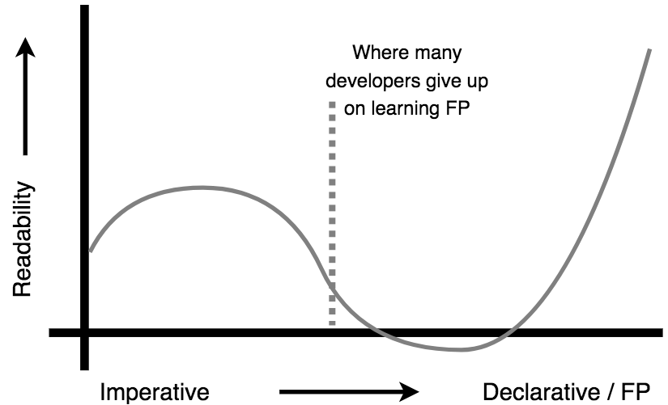

# 章节1：为什么要函数式编程?

> 函数编程人员：（名词）将变量命名为“x”，将函数命名为“f”，并将代码模式命名为“zygohistomorphic prepromorphism”。
>
> James Iry @jamesiry 5/13/15
>
> https://twitter.com/jamesiry/status/598547781515485184

函数式编程（FP）并不是一个新概念。但它几乎贯穿了整个编程历史。不过，我不确定这样说是否合理，但是…直到最近几年，函数式编程才成为整个开发界的主流观念。所以我觉得函数式编程更像是学者的领域。

然而一切都在改变。不仅仅是在语言层面，甚至是在库和框架方面对函数式编程的兴趣正在与日俱增。你很可能读到了这篇文章，因为你最后也会意识到函数式编程是一个你不能再忽视的东西。或者你像我一样，你以前学过很多次函数式编程，但是很难理解其中所有的术语或数学符号。

第一章的目的是回答诸如“为什么要在代码中使用函数式编程的风格”之类的问题。“JavaScript轻量级函数式编程“与其他人对函数式编程的看法相比如何？”在我们做好基础准备之后，通过在本书的其余部分中，我们将一块一块地揭示以轻量级风格编写JS的技术和模式。

## 快照

让我们用代码的前后快照简要说明“JavaScript轻量级函数式编程”的概念。思考下列代码：

```js
var numbers = [4,10,0,27,42,17,15,-6,58];
var faves = [];
var magicNumber = 0;

pickFavoriteNumbers();
calculateMagicNumber();
outputMsg();                // The magic number is: 42

// ***************

function calculateMagicNumber() {
    for (let fave of faves) {
        magicNumber = magicNumber + fave;
    }
}

function pickFavoriteNumbers() {
    for (let num of numbers) {
        if (num >= 10 && num <= 20) {
            faves.push( num );
        }
    }
}

function outputMsg() {
    var msg = `The magic number is: ${magicNumber}`;
    console.log( msg );
}
```

现在考虑一种完全不同的风格，它可以实现相同的结果：

```js
var sumOnlyFavorites = FP.compose( [
    FP.filterReducer( FP.gte( 10 ) ),
    FP.filterReducer( FP.lte( 20 ) )
] )( sum );

var printMagicNumber = FP.pipe( [
    FP.reduce( sumOnlyFavorites, 0 ),
    constructMsg,
    console.log
] );

var numbers = [4,10,0,27,42,17,15,-6,58];

printMagicNumber( numbers );        // The magic number is: 42

// ***************

function sum(x,y) { return x + y; }
function constructMsg(v) { return `The magic number is: ${v}`; }
```

一旦你理解了函数式编程和轻量函数，第二个代码片段很可能是你阅读并脑中想着处理的方式：

> 我们首先创建一个函数 `sumOnlyFavorites(..)` 这是其他三个函数的组合。 我们结合了两个过滤器, 一个检查值是否大于或等于10，一个检查值是否小于或等于20. 然后我们使用 `sum(..)` 减少数据传输. 结果函数 `sumOnlyFavorites(..)`  作为缩减作用，用于检查一个值是否通过两个过滤器，如果通过，则将该值添加到累加器值中。
>
> 然后我们使用定义好的函数 `sumOnlyFavorites(..)` 它可以首先减少一个数字列表，然后使用另一个函数 `printMagicNumber(..)` 打印产生通过“sumOnlyFavorites”计算出数字的总和. 函数 `printMagicNumber(..)` 把最后的总数再输送到 `constructMsg(..)`, 进入 `console.log(..)`打印创建一个字符串值结果.

所有这些处理函数与函数式编程的开发人员的”对话“就好像当前相当不熟悉函数式编程的你一样，这本书帮助你像跟其他你熟悉的代码一样跟这种方式进行”对话“

关于此代码比较的其他一些简短说明:

* 对于许多读者来说，前一个片段比后一个片段更接近舒适/可读/可维护性一些。如果是这样思考的话，也完全可以。你也在一个正确的位置下想的。我相信，如果你在整本书中坚持下去，并实践我们所谈论的一切，第二个片段最终会变得更加自然，甚至更可取！

* 您可能已经完成了这项任务，可能这与所提供的任何一个代码片段都有显著的或完全的不同。也没关系。这本书并没有特定性的说你应该以一种特定的方式做某件事时。目的是说明各种模式的优缺点，并使您能够做出这些决定。在本书的最后，您将如何处理这个任务可能会比现在更接近第二个片段。

* 也有可能你已经是一个经验丰富的函数式编程开发人员，正在浏览这本书的开头，看看它是否有任何有用的东西供你阅读。第二个片段肯定有一些非常熟悉的片段。但我敢打赌你会想，“嗯，我不会那样做的……”好几次。没关系，完全合理

    这不是一本传统的、规范的函数式编程书。我们的方法有时会显得很离经叛道。我们正在寻求在函数式编程明显的不可否认的好处与需要运送可操作、可维护的JS之间达成一个务实的平衡，而不必处理数学/符号/术语这座令人望而生畏的大山。这不是你独有的函数式编程，它是“js的轻量函数式编程”。

无论你出于何目的翻阅本书，欢迎加入我们！

## 信心

我有一个非常简单的前提，那就是作为一名软件开发教师，我所做的每一件事情的基础（在javascript中）：您不能信任的代码是您不理解的代码。反过来也是正确的：你不理解的代码是你不能信任的代码。此外，如果您不能信任或理解您的代码，那么您就不能对您编写的代码是否适合该任务。你运行程序，基本上就是交叉手指，祈祷没有问题发生了。

我所说的信任是什么意思？我的意思是，你可以通过阅读和推理，而不仅仅是执行来验证你理解一段代码将要做什么；而不是依赖它应该做什么的层面上。通常情况下，我们倾向于依靠运行测试来验证程序的正确性。我不是说测试不好。但是我认为我们应该渴望能够充分理解我们的代码，这样我们就知道测试在运行之前会通过。.

仅仅通过阅读代码就能让他们对我们的程序有更多信心，形成函数式编程的技术是以这样的心态设计的。理解函数式编程的人，并且有足够的自我约束在他们的程序中频繁地使用它，他们将编写代码，他们和其他人可以阅读并验证程序如他们想的一样运行。

当我们使用避免或最小化可能的错误源的技术时，信心也会大大增强。这可能是函数式编程最大卖点之一：函数式编程的程序通常比较少的错误，而且存在的错误通常在一些更明显的地方，因此更容易找到和修复。函数式编程代码趋向于更具防bug性——当然不只是为防代码错误的。

在阅读本书的过程中，您将开始对编写的代码培养更多的信心，因为您将使用已经很好证明的模式和实践；并且您将避免最常见的程序错误！

## 沟通

为什么函数式编程很重要？为了回答这个问题，我们需要后退一大步，讨论为什么编程本身很重要。

听到这个可能会让你吃惊，但我不认为代码只是计算机的一组指令。实际上，我认为代码指示计算机这几乎是一个愉快的意外。

我非常深刻地相信，代码的更重要的作用是作为与其他人交流的一种手段。

你可能从经验中知道，你花在“编码”上的大量时间实际上是花在阅读现有代码上。我们中很少有人享有这样的特权：把全部或大部分时间都花在简单地敲出所有新代码上，从不处理别人（或我们过去的自己）写的代码上。

据广泛估计，开发人员将70%的代码维护时间花在阅读上以理解它。这真让人大开眼界。居然达到了70%。难怪程序员每天编写的代码行数的平均值大约是10行。我们每天花7个小时来阅读代码，去理解这10行怎么运行！

我们需要更加关注代码的可读性。还得提一下，可读性不仅仅是字符数的减少，可读性实际上最受熟悉度的影响。
<a href="#user-content-footnote-1"><sup>1</sup></a>

如果我们要花时间来写更易于阅读和理解的代码，那么函数式编程就是这项工作的核心。函数式编程的原则是建立良好的，深入研究和审查，并可证实的。花时间学习和使用这些函数式编程原则最终将为您和其他人带来更容易识别的熟悉代码。代码熟悉度的提高以及识别的便利性将提高代码的可读性。


例如，一旦您学习了“map（…）”的功能，当您在任何程序中看到它时，您几乎可以立即发现并理解它。 但是每次你看到一个“for”循环，你就必须阅读整个循环才能理解它。“for”循环的语法可能是熟悉的，但实际上它所做的并不是；你每次都必须*读*才能理解。

通过拥有看一眼就能识别的代码的能力，从而减少时间去了解代码在做什么，我们的注意力被释放出来，去思考更高层次的程序逻辑；那些都是最需要我们关注的重要内容。
By having more code that's recognizable at a glance, and thus spending less time figuring out what the code is doing, our focus is freed up to think about the higher levels of program logic; this is the important stuff that most needs our attention anyway.

函数式编程 (至少，没有所有的术语来衡量它) 是制作可读代码最有效的工具之一。 这也是它如此重要的原因。

## 可读性

可读性不是一个二进制特性。这在很大程度上是描述我们与代码关系的主观因素。随着时间的推移，我们的技能和理解自然会发生变化。我曾经历过类似下图的效果，而且我也曾与许多人聊过关于这些有趣的事。

<p align="center">
    
</p>

你可能会发现，当你读这本书的时候，你也会有类似的感受。但振作起来;如果你坚持下去，曲线就会上升!

命令式代码描述我们大多数人已经自然编写的代码;它专注于精确指导计算机“如何”做某事。而我们将学习编写的声明式代码，它遵循函数式编程原则是更专注于描述结果输出的代码。

让我们回顾本章前面介绍的两个代码片段。

第一个片段是命令式的，几乎完全集中于“如何”完成任务;它充斥着“if”语句、“for”循环、临时变量、重新分配、值突变、带有副作用的函数调用以及函数之间的隐式数据流。当然，你“可以”通过它的逻辑来查看数字是如何流动和更改到最终状态的，但它一点也不清楚或直接。

第二个片段更具声明性一些;它消除了前面提到的大多数命令式技术。注意没有显式的条件、循环、副作用、重新分配或突变;相反，它使用我们所说的函数式编程和可信的模式，如过滤、还原、转换和组合。注重从低级别的“如何”转移到高级的“结果”。

我们没有使用“if”语句来测试一个数字，而是将其委托给一个函数式编程里的实用程序，如“gte(..)”(大于或等于)去操作，然后将重点放在更重要的任务上，即将该过滤器与另一个过滤器和求和函数组合起来，得到我们想要的结果。

此外，通过第二个程序的数据流是明确的:

1. 一系列数字经过函数 `printMagicNumber(..)`.
2. 这些数字由“sumOnlyFavorites(..)”依次次处理，最后结果得到一个数字，其中得出一个我们最喜欢的数字
3. 这个总数被“constructMsg(..)”函数转换为一个带有的消息字符串。
4. 消息字符串通过`console.log(..)`打印出来.

从上面可以看到命令式代码片段更容易理解，但您可能仍然觉得这种方法很复杂，你的习惯与熟悉度对可读性的判断有深刻的影响。不过，在本书的最后，您将会潜移默化的了解到第二个代码片段的声明性方法的优点，并且熟悉性将使其可读性更强。

我知道让你相信这一点是一种信仰的飞跃。

正如我所建议的，要提高它的可读性，并最小化或消除导致bug的许多错误，需要付出更多的努力，有时还需要编写更多的代码。坦白地说，当我开始写这本书的时候，我可能还完全写不出(甚至完全理解)第二段。当我更深入学习的时候，一切都变得自然与舒适。

如果您希望使用函数式编程重构，那这就像一个神奇的银弹，能够快速地将您的代码转换为更优雅、更优雅、更聪明、更有弹性、更简洁的代码(短期内很容易实现)，万幸的是，这是一个现实的期望不难实现。

函数式编程是一种非常不同的方式来考虑代码应该如何构造，从而使数据流更加明显，并帮助读者跟随您的想法。这需要时间。这一努力非常值得，但可能是一段艰苦的旅程。

通常，我仍然需要多次尝试将命令式代码片段重构为更具声明性的函数式编程模式的代码，然后才能得到一些足够清晰的代码，以便以后能够理解。我发现转换到函数式编程模式是一个缓慢的迭代过程，不像从一个范例到另一个范例的二进制转换那样快速。

我还将“以后再教”测试应用到我编写的每段代码中。在我写完一段代码后，我会把它放在一边几个小时或几天，然后回来，试着用新的眼光来读它，假装我需要教别人或向别人解释它。通常，这样给别人解释的时候相当混乱，而且要不断的调整那些代码!

我不是想让你扫兴。我真希望你能解开疑惑。我很高兴我做到了。我最终可以看到上面图像解释的曲线向上弯曲的状态，改造代码以提高可读性。这些努力是值得的。

## 客观判断

大多数FP文本似乎都采取了自上而下的方法，但我们会以相反的方向：从头开始，我们将揭示基本的基本原则，我相信正式的FP使用者会承认这是他们所做一切的脚手架。但在很大程度上，我们会与大多数吓人的术语或数学符号保持一定距离，因为这些术语或数学符号很容易让学习者感到沮丧。

我相信你所说的东西不那么重要，更重要的是你要了解它是什么以及它是如何工作的。这并不是说共享术语不重要——毫无疑问，它简化了经验丰富的专业人员之间的交流。但对于学习者来说，我发现这会分散注意力。

因此，这本书将会更多地集中在基本概念，而不是花里胡哨的说些无意义的事情上。这并不是说没有术语，而是肯定会有术语。但不要过于沉溺于复杂的语言中。在必要的时候，超越他们去考虑这些想法。

我把这些不太正式的实践称为“轻量编程”，我认为真正的FP的形式主义所受害的地方是，如果你还不习惯于正式的思想，它可能是非常压倒性的。我不只是简单猜测，从我自己的故事中可以说明。即使在教过FP和写过这本书之后，我仍然可以说，FP中的术语和符号的形式主义对我来说是非常难以处理的。我试过又试，但还是觉得难以处理。

我知道许多人相信形式主义的方式有助于学习。但我认为很明显这是一个误解，只有当你对形式主义有了一定的了解后，才会认识到。如果你恰好已经有了数学背景，甚至是一些CS经验，这对你来说可能更自然。但是我们中的一些人没有，不管我们多么努力，形式主义总是阻碍我们。

所以这本书介绍了我相信函数编程是建立在其基础上的概念，但它是通过从下面给你一个动力来爬上悬崖峭壁，而不是屈尊地从顶部冲你喊叫，督促你去弄清楚怎么爬。

## 如何找到平衡

如果你已经在编程方面工作很长时间了，很可能你以前听过“YAGNI”这个缩写：“You Ain’t Gonna Need It”（“你不需要它”）。这个原则主要来自于极端编程，强调在需要之前构建一个特性的高风险和成本。.

“YAGNI”挑战让我们要记住：即使在某种情况下这是违反直觉的，我们通常也应该推迟建造一些东西，直到目前需要它为止。我们倾向于夸大我们对未来重构的估计，即在需要时稍后添加重构的成本。很可能，以后做起来并不像我们想象的那么困难。

当它应用于函数式编程时，我会给出这样的警告：在本文中会讨论许多有趣的模式，但只因为您发现一些令人兴奋的模式可以应用，在您的代码的应用这些模式可能未必合适。

这就是我不同于许多正式的函数编程人员的地方：仅仅是因为您*可以*将函数编程模式应用于某个东西，但并不意味着您就*应该*将函数编程模式应用于到你的代码上。此外，有很多方法可以分割一个问题，即使您可能已经学习了一种更为复杂的方法，这种方法对维护和可扩展性来说更具“未来证明”，但在这一点上，更简单的函数编程模式可能就足够了。

一般来说，我建议您在编写代码时寻求平衡，并在掌握了一些技巧后，在应用函数编程概念时保持保守。在决定某个特定的模式或抽象的时候，考虑是否有助于该部分代码更具可读性，或者它只是引入了尚不保证的巧妙的复杂性时，默认了“YAGNI”原则。

> 提醒一下，任何从未使用过的扩展点不仅仅是浪费精力，还可能妨碍您的工作。
>
> Jeremy D. Miller @jeremydmiller 2/20/15
>
> https://twitter.com/jeremydmiller/status/568797862441586688

记住，您编写的每一行代码都会有相应的阅读成本。看这代码的人可能是团队的成员，甚至是你未来的自己。谁都不会对看起来老练的代码印象深刻，代码只是为了炫耀你的函数编程能力罢了。

最好的代码是未来可读性最高的代码，因为它在理想与实用之间达到了正确的平衡。

## 资源

我利用了大量不同的资源来撰写这篇文章。我相信你也会从中受益，下面花点时间简单介绍一下。

### 相关书籍

一些你不可错过的函数编程/JS书籍:

* [Professor Frisby's Mostly Adequate Guide to Functional Programming](https://drboolean.gitbooks.io/mostly-adequate-guide/content/ch1.html) by [Brian Lonsdorf](https://twitter.com/drboolean)
* [JavaScript Allongé](https://leanpub.com/javascriptallongesix) by [Reg Braithwaite](https://twitter.com/raganwald)
* [Functional JavaScript](http://shop.oreilly.com/product/0636920028857.do) by [Michael Fogus](https://twitter.com/fogus)

### 博客/网站

一些作者和内容:

* [Fun Fun Function Videos](https://www.youtube.com/watch?v=BMUiFMZr7vk) by [Mattias P Johansson](https://twitter.com/mpjme)
* [Awesome FP JS](https://github.com/stoeffel/awesome-fp-js)
* [Kris Jenkins](http://blog.jenkster.com/2015/12/what-is-functional-programming.html)
* [Eric Elliott](https://medium.com/@_ericelliott)
* [James A Forbes](https://james-forbes.com/)
* [James Longster](https://github.com/jlongster)
* [André Staltz](http://staltz.com/)
* [Functional Programming Jargon](https://github.com/hemanth/functional-programming-jargon#functional-programming-jargon)
* [Functional Programming Exercises](https://github.com/InceptionCode/Functional-Programming-Exercises)

### 资源库

这本书中的代码片段在很大程度上不依赖于库。我们发现的每一个操作，都将派生出如何在独立的纯javascript中实现它。但是，当您开始使用函数式编程构建更多的实际代码时，您很快就会希望库能够提供这些常见的实用程序的优化和高度可靠的版本。

顺便说一下，您需要检查文档中所使用的库函数，以确保您知道它们是如何工作的。它们中的许多与我们在本文中构建的代码有很多相似之处，但毫无疑问，即使在流行的库之间，也会存在一些差异。

下面是几个流行的JavaScript FP库，是您开始探索的好地方:

* [Ramda](http://ramdajs.com)
* [lodash/fp](https://github.com/lodash/lodash/wiki/FP-Guide)
* [functional.js](http://functionaljs.com/)
* [Immutable.js](https://github.com/facebook/immutable-js)

[附录C](apC.md/#stuff-to-investigate) 对这些库和其他库进行了更深入的研究.

## 总结

你可能有各种各样的理由开始读这本书，以及对你能从中得到什么的不同期望。这一章解释了为什么我要你读这本书，以及我要你从中得到什么。它还可以帮助您向其他人（如您的开发伙伴）清楚地表达为什么他们应该与您一起读这本书！

函数式编程是关于编写基于经验证的原则的代码，这样我们就可以对编写和读取的代码有自信。我们不应该满足于编写揣测的工作代码，然后测试通过后松了一口气的状态。在运行它之前，我们应该*知道*它将做什么，并且我们应该确信我们已经在代码中为其他读者（包括我们未来的自己）传达了所有这些想法。

这是该书的核心。我们的目标是学会有效地与我们的代码通信，但不必为了达到目的而困惑在符号或术语的复杂中。

学习函数编程从深入了解函数的本质开始。这就是我们在下一章要讨论的问题。

----
