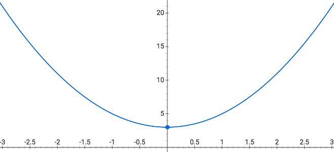

# 章节2: 函数的性质

函数式编程不仅仅是用“function”关键字进行定义来编程。如果这么简单的话，我可以在这里结束这本书！函数确实是函数式编程的核心。而且函数的方式使我们的代码*起作用*。

但是你有多确定“函数”的真正含义？

在这一章中，我们将通过探索函数的所有基本面，为本书的其余部分奠定基础。实际上，这是对所有内容的回顾，即使是非函数式编程程序员也应该了解函数。但当然，如果我们想从函数式编程的概念中得到最大的好处，我们就必须了解内部和外部的函数。

打起精神来，因为这个功能比你想象的要多得多。

## 什么是函数？

这个问题，从表面上看，似乎有一个显而易见的答案：函数是可以执行一次或多次的代码集合。

虽然这个定义看起来很合理，但它缺少一些非常重要的本质，即*函数*的核心，因为它适用于函数式编程。因此，让我们从表面开始挖掘，以更全面地理解函数。

### 简单的数学复习

我知道我答应过我们会尽量远离数学，但是在我们继续之前，请稍等片刻，因为我们很快就能从代数中观察到一些关于函数和图的基本知识。

你记得在学校里学过“f（x）”或者“y=f（x）”吗？

假设一个方程是这样定义的: <code>f(x) = 2x<sup>2</sup> + 3</code>. 那是什么意思？用图表表示这个方程意味着什么？下面是图表:

<p align="center">
    
</p>

你能注意到的是，对于x的任何值，比如2，如果你把它插入方程，你得到11。11是什么？它是f（x）函数的返回值，前面我们说它代表y值。

换句话说，我们可以选择将输入和输出值解释为图中曲线上`（2，11）`处的点。对于我们插入的每一个'x'值，我们得到另一个'y'值，作为一个点的坐标与它配对。另一个是`（0,3）`，另一个是`（-1,5）`。把所有这些点放在一起，就得到了抛物线图，如图所示。

那么，这和函数式编程有什么关系呢？

在数学中，函数总是有输入并有输出。在函数式编程中经常听到的一个术语是’态射‘（morphism）；两个数学结构之间保持结构的一种过程抽象方法，例如与该函数的输出对应另一函数的输入。

在代数数学中，这些输入和输出通常被解释为要绘制图形的坐标的组成部分。然而，在我们的程序中，虽然很少被解释为图形上的可视绘制曲线，当时我们可以定义具有各种输入和输出的函数。

### 功能与程序

那么，为什么老是在讨论数学与图表呢？因为本质上，函数式编程就是在数学意义上接受使用函数方法作为特定程序。

您可能更习惯于将函数视为过程。有什么区别？过程是功能的任意集合。它可能有输入，也可能没有。它可能有输出（返回一个值），也可能没有。

函数接受输入，并且一定有一个“返回”值。

如果您计划进行函数编程，**您应该尽可能多地使用函数**，并尽可能避免使用过程。所有的“函数”都应该接受输入并返回输出。

为什么这么做？这有很多层面的意义，我们会在本书中揭露。

## 函数的输入

到目前为止，我们可以得出这样的结论：函数必须有输入。但让我们来深入研究函数输入是如何工作的。

您有时会听到人们将这些输入称为“参数”，有时称为“因素”。那这是怎么回事？

*参数*是您传入的值，*因素*是接收传入值的函数内的命名变量。例子：

```js
function foo(x,y) {
    // ..
}

var a = 3;

foo( a, a * 2 );
```
`“a”和“a*2”是函数“foo（…）”调用的*参数*，“x”和“y”是接收参数值的*参数*（分别为“3”和“6”（“a*2”的结果））。

**注意：**在javascript中，不要求*参数*的数量与函数*因素*的数量匹配。如果传递的*参数*多于声明接收它们的函数*参数*，那么这些值就不会受到影响。这些值可以通过几种不同的方式访问，包括以前可能听说过的“arguments”对象。如果传递的*参数*少于声明的函数*参数*，则每个不匹配的参数都将被视为“未定义”变量，这意味着它在函数的作用域内存在并可用，但只以空的“未定义”值开始。

### 默认参数

从ES6开始，参数可以声明*默认值*。如果没有传递该参数的参数，或者传递了值“undefined”，则将替换默认的赋值表达式。

想一想:

```js
function foo(x = 3) {
    console.log( x );
}

foo();                  // 3
foo( undefined );       // 3
foo( null );            // null
foo( 0 );               // 0
```
考虑有助于函数可用性的默认情况是一个很好的实践。然而，在读取和理解函数如何被调用的变化方面，默认参数可能会导致更复杂的问题。在多大程度上依赖此功能方面要谨慎。

### 计数输入

函数“预期”的参数个数由声明的参数个数决定，预期个数就是您可能希望传递给它的参数个数:

```js
function foo(x,y,z) {
    // ..
}
```
` foo（..）`需要三个参数，因为它有三个已声明的参数。这个计数有一个特殊的术语：参数数量。参数数量是指函数声明中的参数个数。“foo（…）”的参数数量为“3”。

此外，一个参数的函数也称为“一元”函数，二个参数的函数也称为“二元”函数，n个参数或更高的函数称为“n元”函数。


您可能希望在程序运行时检查函数引用以确定其参数个数。这可以通过函数引用的“length”属性来实现：

```js
function foo(x,y,z) {
    // ..
}

foo.length;             // 3
```
在执行期间确定参数个数的一个原因是，一段代码可以从多个地方引用一个函数，并根据参数个数的不同发送不同的值。

例如，假设一个情况，一个“fn”函数引用可能需要一个、两个或三个参数，但您总是希望在最后一个位置传递一个变量“x”:

```js
// `fn` 设置为某个函数引用
// `x` 存在一些值

if (fn.length == 1) {
    fn( x );
}
else if (fn.length == 2) {
    fn( undefined, x );
}
else if (fn.length == 3) {
    fn( undefined, undefined, x );
}
```
**提示：**函数的“length”属性是只读的，声明函数时就已经确定。它被看作是一段描述函数预期用途的元数据。

需要注意的一点是，某些类型的参数列表可能会使函数的“length”属性与您可能期望的不同：


```js
function foo(x,y = 2) {
    // ..
}

function bar(x,...args) {
    // ..
}

function baz( {a,b} ) {
    // ..
}

foo.length;             // 1
bar.length;             // 1
baz.length;             // 1
```
要计算当前函数调用接收到的参数个数？这曾经是微不足道的，但现在情况稍微复杂一些。每个函数都有一个“arguments”对象（类似于数组），用于保存对传入的每个参数的引用。然后可以检查“arguments”的“length”属性，以确定实际传递了多少个:

```js
function foo(x,y,z) {
    console.log( arguments.length );
}

foo( 3, 4 );    // 2
```

从ES5（特别是严格模式）开始，“arguments”被一些人认为是不赞成使用的；许多人会避免使用它。在JS中，我们“从不”破坏向后兼容性，不管这对将来的进展有多大帮助，所以“arguments”永远不会被删除。但现在普遍建议尽可能避免使用它

但是，我建议“arguments.length”，仅用于可以需要传递的参数数量的情况。未来版本的JS可能会添加一个功能，该功能可以确定传递的参数的数量，而不需要查询“arguments.length”；如果发生这种情况，那么我们可以完全放弃使用“arguments”！

小心：**从不**按位置访问参数，如“arguments[1]”。如果必须的话，只保留对“arguments.length”的引用。

另外，如何在声明参数之外的位置访问传递的参数？我稍后回答；但首先仔细考虑一下问问自己，“我为什么要这样做？”。

这种情况应该很少发生；它不应该是您在编写函数时经常需要使用的方式。如果您发现自己处于这样的场景中，请花费额外的20分钟尝试以不同的方式设计与该函数的交互。命名这个额外的论点，即使它是例外的。

接受不确定数量参数的函数称为可变函数。有些人更喜欢这种类型的功能设计，但我认为您会发现，一般情况下，函数编程人员通常会避免这样设计。

好吧，就这一点说得够多了。

假设您确实需要以类数组的方式访问参数，可能是您访问的参数在该位置没有正式参数的需要。那我们要怎么做？

ES6可以解决这一点！可以用`…`操作符来声明我们的函数——各种各样地称为“spread”、“rest”或“gather”（我的首选项）：

```js
function foo(x,y,z,...args) {
    // ..
}
```

看到参数列表中的“…args”？这是一个ES6声明形式，它告诉引擎收集所有未分配给命名参数的剩余参数，并将它们放入名为“args”的实数数组中。` args`将始终是一个数组，即使它是空的。但它**不会**包括分配给“x”、“y”和“z”参数的值，只包括超出前三个值的其他值：

```js
function foo(x,y,z,...args) {
    console.log( x, y, z, args );
}

foo();                  // undefined undefined undefined []
foo( 1, 2, 3 );         // 1 2 3 []
foo( 1, 2, 3, 4 );      // 1 2 3 [ 4 ]
foo( 1, 2, 3, 4, 5 );   // 1 2 3 [ 4, 5 ]
```

因此，如果您*真的*想设计一个函数来解释要传入的任意数量的参数，请在末尾使用“…args”（也可以使用其他变量名称）。现在，您将拥有一个真正的、不推荐使用的、不易出错的数组来访问这些参数值。

注意值“4”位于“args”的“0”位置，而不是“3”位置。它的“length”值不包括这三个“1”、“2”和“3”值。`…args'收集其他所有的参数，不包括'x'、'y'和'z'。

您*可以*使用参数列表中的“…”扩展运算符，即使没有声明其他正式参数：

```js
function foo(...args) {
    // ..
}
```
现在，“args”将是参数的完整数组，不管它们是什么，您可以使用“args.length”来确切知道传入了多少个参数。如果你这样做的话，使用“args[1]”或“args[317]”是安全的。不过，请不要传递318个参数。

### 参数数组

如果您想将一个数组作为参数传递给函数调用，该怎么办？

```js
function foo(...args) {
    console.log( args[3] );
}

var arr = [ 1, 2, 3, 4, 5 ];

foo( ...arr );                      // 4
```

上面“…”被使用了，但现在不仅在参数列表中；它也在调用函数的参数列表中使用。在这种情况下，它有相反的行为。在参数列表中，我们说它*收集*参数个数。在参数列表中，`...`是*展开*了数组的参数。所以“arr”的内容实际上是作为“foo（…）”调用的单个参数展开的。那这和仅仅传递一个对整个“arr”数组的引用有什么不同吗？

还有，多个值和`…`扩展参数可以交错：

```js
var arr = [ 2 ];

foo( 1, ...arr, 3, ...[4,5] );      // 4
```
思考这个“…”：在值列表位置，它是*展开*的功能。在赋值位置的参数列表收集参数，赋值给使用参数。

无论您调用哪种行为，`…`都会使处理参数数组更加容易。“slice（…）”、“concat（…）”和“apply（…）”的日子已经变得没有用了，这些方法都需要数组参数值。

**提示：**实际上，这些方法并不是完全无用的。在本书的整个代码中，我们将有一些地方依赖它们。但是，在大多数地方，`…`将会更加声明性地可读，因此更可取。

### Parameter Destructuring

Consider the variadic `foo(..)` from the previous section:

```js
function foo(...args) {
    // ..
}

foo( ...[1,2,3] );
```

What if we wanted to change that interaction so the caller of our function passes in an array of values instead of individual argument values? Just drop the two `...` usages:

```js
function foo(args) {
    // ..
}

foo( [1,2,3] );
```

Simple enough. But what if now we wanted to give a parameter name to each of the first two values in the passed-in array? We aren't declaring individual parameters anymore, so it seems we lost that ability.

Thankfully, ES6 destructuring is the answer. Destructuring is a way to declare a *pattern* for the kind of structure (object, array, etc.) that you expect to see, and how decomposition (assignment) of its individual parts should be processed.

Consider:

<a name="funcparamdestr"></a>

```js
function foo( [x,y,...args] = [] ) {
    // ..
}

foo( [1,2,3] );
```

Do you spot the `[ .. ]` brackets around the parameter list now? This is called array parameter destructuring.

In this example, destructuring tells the engine that an array is expected in this assignment position (aka parameter). The pattern says to take the first value of that array and assign to a local parameter variable called `x`, the second to `y`, and whatever is left is *gathered* into `args`.

### The Importance of Declarative Style

Considering the destructured `foo(..)` we just looked at, we could instead have processed the parameters manually:

```js
function foo(params) {
    var x = params[0];
    var y = params[1];
    var args = params.slice( 2 );

    // ..
}
```

But here we highlight a principle we only briefly introduced in [Chapter 1](ch1.md/#readability): declarative code communicates more effectively than imperative code.

Declarative code (for example, the destructuring in the former `foo(..)` snippet, or the `...` operator usages) focuses on what the outcome of a piece of code should be.

Imperative code (such as the manual assignments in the latter snippet) focuses more on how to get the outcome. If you later read such imperative code, you have to mentally execute all of it to understand the desired outcome. The outcome is *coded* there, but it's not as clear because it's clouded by the details of *how* we get there.

The earlier `foo(..)` is regarded as more readable, because the destructuring hides the unnecessary details of *how* to manage the parameter inputs; the reader is free to focus only on *what* we will do with those parameters. That's clearly the most important concern, so it's what the reader should be focused on to understand the code most completely.

Wherever possible, and to whatever degrees our language and our libraries/frameworks will let us, **we should be striving for declarative, self-explanatory code.**

## Named Arguments

Just as we can destructure array parameters, we can destructure object parameters:

```js
function foo( {x,y} = {} ) {
    console.log( x, y );
}

foo( {
    y: 3
} );                    // undefined 3
```

We pass in an object as the single argument, and it's destructured into two separate parameter variables `x` and `y`, which are assigned the values of those corresponding property names from the object passed in. It didn't matter that the `x` property wasn't on the object; it just ended up as a variable with `undefined` like you'd expect.

But the part of parameter object destructuring I want you to pay attention to is the object being passed into `foo(..)`.

With a normal call-site like `foo(undefined,3)`, position is used to map from argument to parameter; we put the `3` in the second position to get it assigned to a `y` parameter. But at this new kind of call-site where parameter destructuring is involved, a simple object-property indicates which parameter (`y`) the argument value `3` should be assigned to.

We didn't have to account for `x` in *that* call-site because in effect we didn't care about `x`. We just omitted it, instead of having to do something distracting like passing `undefined` as a positional placeholder.

Some languages have an explicit feature for this: named arguments. In other words, at the call-site, labeling an input value to indicate which parameter it maps to. JavaScript doesn't have named arguments, but parameter object destructuring is the next best thing.

Another FP-related benefit of using an object destructuring to pass in potentially multiple arguments is that a function that only takes one parameter (the object) is much easier to compose with another function's single output. Much more on that in [Chapter 4](ch4.md).

### Unordered Parameters

Another key benefit is that named arguments, by virtue of being specified as object properties, are not fundamentally ordered. That means we can specify inputs in whatever order we want:

```js
function foo( {x,y} = {} ) {
    console.log( x, y );
}

foo( {
    y: 3
} );                    // undefined 3
```

We're skipping the `x` parameter by simply omitting it. Or we could specify an `x` argument if we cared to, even if we listed it after `y` in the object literal. The call-site is no longer cluttered by ordered-placeholders like `undefined` to skip a parameter.

Named arguments are much more flexible, and attractive from a readability perspective, especially when the function in question can take three, four, or more inputs.

**Tip:** If this style of function arguments seems useful or interesting to you, check out coverage of my [FPO library in Appendix C](apC.md/#bonus-fpo).

## Function Output

Let's shift our attention from a function's inputs to its output.

In JavaScript, functions always return a value. These three functions all have identical `return` behavior:

```js
function foo() {}

function bar() {
    return;
}

function baz() {
    return undefined;
}
```

The `undefined` value is implicitly `return`ed if you have no `return` or if you just have an empty `return;`.

But keeping as much with the spirit of FP function definition as possible -- using functions and not procedures -- our functions should always have outputs, which means they should explicitly `return` a value, and usually not `undefined`.

A `return` statement can only return a single value. So if your function needs to return multiple values, your only viable option is to collect them into a compound value like an array or an object:

```js
function foo() {
    var retValue1 = 11;
    var retValue2 = 31;
    return [ retValue1, retValue2 ];
}
```

Then, we'll assign `x` and `y` from two respective items in the array that comes back from `foo()`:

```js
var [ x, y ] = foo();
console.log( x + y );           // 42
```

Collecting multiple values into an array (or object) to return, and subsequently destructuring those values back into distinct assignments, is a way to transparently express multiple outputs for a function.

**Tip:** I'd be remiss if I didn't suggest you take a moment to consider if a function needing multiple outputs could be refactored to avoid that, perhaps separated into two or more smaller single-purpose functions? Sometimes that will be possible, sometimes not; but you should at least consider it.

### Early Returns

The `return` statement doesn't just return a value from a function. It's also a flow control structure; it ends the execution of the function at that point. A function with multiple `return` statements thus has multiple possible exit points, meaning that it may be harder to read a function to understand its output behavior if there are many paths that could produce that output.

Consider:

```js
function foo(x) {
    if (x > 10) return x + 1;

    var y = x / 2;

    if (y > 3) {
        if (x % 2 == 0) return x;
    }

    if (y > 1) return y;

    return x;
}
```

Pop quiz: without cheating and running this code in your browser, what does `foo(2)` return? What about `foo(4)`? And `foo(8)`? And `foo(12)`?

How confident are you in your answers? How much mental tax did you pay to get those answers? I got it wrong the first two times I tried to think it through, and I wrote it!

I think part of the readability problem here is that we're using `return` not just to return different values, but also as a flow control construct to quit a function's execution early in certain cases. There are obviously better ways to write that flow control (the `if` logic, etc.), but I also think there are ways to make the output paths more obvious.

**Note:** The answers to the pop quiz are `2`, `2`, `8`, and `13`.

Consider this version of the code:

```js
function foo(x) {
    var retValue;

    if (retValue == undefined && x > 10) {
        retValue = x + 1;
    }

    var y = x / 2;

    if (y > 3) {
        if (retValue == undefined && x % 2 == 0) {
            retValue = x;
        }
    }

    if (retValue == undefined && y > 1) {
        retValue = y;
    }

    if (retValue == undefined) {
        retValue = x;
    }

    return retValue;
}
```

This version is unquestionably more verbose. But I would argue it's slightly simpler logic to follow, because every branch where `retValue` can get set is *guarded* by the condition that checks if it's already been set.

Rather than `return`ing from the function early, we used normal flow control (`if` logic) to determine the `retValue`'s assignment. At the end, we simply `return retValue`.

I'm not unconditionally saying that you should always have a single `return`, or that you should never do early `return`s, but I do think you should be careful about the flow control part of `return` creating more implicitness in your function definitions. Try to figure out the most explicit way to express the logic; that will often be the best way.

### Un`return`ed Outputs

One technique that you've probably used in most code you've written, and maybe didn't even think about it much, is to have a function output some or all of its values by simply changing variables outside itself.

Remember our <code>f(x) = 2x<sup>2</sup> + 3</code> function from earlier in the chapter? We could have defined it like this in JS:

```js
var y;

function f(x) {
    y = (2 * Math.pow( x, 2 )) + 3;
}

f( 2 );

y;                      // 11
```

I know this is a silly example; we could just as easily have `return`d the value instead of setting it into `y` from within the function:

```js
function f(x) {
    return (2 * Math.pow( x, 2 )) + 3;
}

var y = f( 2 );

y;                      // 11
```

Both functions accomplish the same task, so is there any reason we should pick one version over the other? **Yes, absolutely.**

One way to explain the difference is that the `return` in the latter version signals an explicit output, whereas the `y` assignment in the former is an implicit output. You may already have some intuition that guides you in such cases; typically, developers prefer explicit patterns over implicit ones.

But changing a variable in an outer scope, as we did with the `y` assignment inside of `foo(..)`, is just one way of achieving an implicit output. A more subtle example is making changes to non-local values via reference.

Consider:

```js
function sum(list) {
    var total = 0;
    for (let i = 0; i < list.length; i++) {
        if (!list[i]) list[i] = 0;

        total = total + list[i];
    }

    return total;
}

var nums = [ 1, 3, 9, 27, , 84 ];

sum( nums );            // 124
```

The most obvious output from this function is the sum `124`, which we explicitly `return`ed. But do you spot the other output? Try that code and then inspect the `nums` array. Now do you spot the difference?

Instead of an `undefined` empty slot value in position `4`, now there's a `0`. The harmless looking `list[i] = 0` operation ended up affecting the array value on the outside, even though we operated on a local `list` parameter variable.

Why? Because `list` holds a reference-copy of the `nums` reference, not a value-copy of the `[1,3,9,..]` array value. JavaScript uses references and reference-copies for arrays, objects, and functions, so we may create an accidental output from our function all too easily.

This implicit function output has a special name in the FP world: side effects. And a function that has *no side effects* also has a special name: pure function. We'll talk a lot more about these in [Chapter 5](ch5.md), but the punchline is that we'll want to prefer pure functions and avoid side effects wherever possible.

## Functions of Functions

Functions can receive and return values of any type. A function that receives or returns one or more other function values has the special name: higher-order function.

Consider:

```js
function forEach(list,fn) {
    for (let v of list) {
        fn( v );
    }
}

forEach( [1,2,3,4,5], function each(val){
    console.log( val );
} );
// 1 2 3 4 5
```

`forEach(..)` is a higher-order function because it receives a function as an argument.

A higher-order function can also output another function, like:

```js
function foo() {
    return function inner(msg){
        return msg.toUpperCase();
    };
}

var f = foo();

f( "Hello!" );          // HELLO!
```

`return` is not the only way to "output" an inner function:

```js
function foo() {
    return bar( function inner(msg){
        return msg.toUpperCase();
    } );
}

function bar(func) {
    return func( "Hello!" );
}

foo();                  // HELLO!
```

Functions that treat other functions as values are higher-order functions by definition. FPers write these all the time!

### Keeping Scope

One of the most powerful things in all of programming, and especially in FP, is how a function behaves when it's inside another function's scope. When the inner function makes reference to a variable from the outer function, this is called closure.

Defined pragmatically:

> Closure is when a function remembers and accesses variables from outside of its own scope, even when that function is executed in a different scope.

Consider:

```js
function foo(msg) {
    var fn = function inner(){
        return msg.toUpperCase();
    };

    return fn;
}

var helloFn = foo( "Hello!" );

helloFn();              // HELLO!
```

The `msg` parameter variable in the scope of `foo(..)` is referenced inside the inner function. When `foo(..)` is executed and the inner function is created, it captures the access to the `msg` variable, and retains that access even after being `return`ed.

Once we have `helloFn`, a reference to the inner function, `foo(..)` has finished and it would seem as if its scope should have gone away, meaning the `msg` variable would no longer exist. But that doesn't happen, because the inner function has a closure over `msg` that keeps it alive. The closed over `msg` variable survives for as long as the inner function (now referenced by `helloFn` in a different scope) stays around.

Let's look at a few more examples of closure in action:

```js
function person(name) {
    return function identify(){
        console.log( `I am ${name}` );
    };
}

var fred = person( "Fred" );
var susan = person( "Susan" );

fred();                 // I am Fred
susan();                // I am Susan
```

The inner function `identify()` has closure over the parameter `name`.

The access that closure enables is not restricted to merely reading the variable's original value -- it's not just a snapshot but rather a live link. You can update the value, and that new current state remains remembered until the next access:

```js
function runningCounter(start) {
    var val = start;

    return function current(increment = 1){
        val = val + increment;
        return val;
    };
}

var score = runningCounter( 0 );

score();                // 1
score();                // 2
score( 13 );            // 15
```

**Warning:** For reasons that we'll explore in more depth later in the book, this example of using closure to remember a state that changes (`val`) is probably something you'll want to avoid where possible.

If you have an operation that needs two inputs, one of which you know now but the other will be specified later, you can use closure to remember the first input:

```js
function makeAdder(x) {
    return function sum(y){
        return x + y;
    };
}

// we already know `10` and `37` as first inputs, respectively
var addTo10 = makeAdder( 10 );
var addTo37 = makeAdder( 37 );

// later, we specify the second inputs
addTo10( 3 );           // 13
addTo10( 90 );          // 100

addTo37( 13 );          // 50
```

Normally, a `sum(..)` function would take both an `x` and `y` input to add them together. But in this example we receive and remember (via closure) the `x` value(s) first, while the `y` value(s) are separately specified later.

**Note:** This technique of specifying inputs in successive function calls is very common in FP, and comes in two forms: partial application and currying. We'll dive into them more thoroughly in [Chapter 3](ch3.md/#some-now-some-later).

Of course, since functions are just values in JS, we can remember function values via closure:

```js
function formatter(formatFn) {
    return function inner(str){
        return formatFn( str );
    };
}

var lower = formatter( function formatting(v){
    return v.toLowerCase();
} );

var upperFirst = formatter( function formatting(v){
    return v[0].toUpperCase() + v.substr( 1 ).toLowerCase();
} );

lower( "WOW" );             // wow
upperFirst( "hello" );      // Hello
```

Instead of distributing/repeating the `toUpperCase()` and `toLowerCase()` logic all over our code, FP encourages us to create simple functions that encapsulate -- a fancy way of saying wrapping up -- that behavior.

Specifically, we create two simple unary functions `lower(..)` and `upperFirst(..)`, because those functions will be much easier to wire up to work with other functions in the rest of our program.

**Tip:** Did you spot how `upperFirst(..)` could have used `lower(..)`?

We'll use closure heavily throughout the rest of the text. It may just be the most important foundational practice in all of FP, if not programming as a whole. Make sure you're really comfortable with it!

## Syntax

Before we move on from this primer on functions, let's take a moment to discuss their syntax.

More than many other parts of this text, the discussions in this section are mostly opinion and preference, whether you agree with the views presented here or take opposite ones. These ideas are highly subjective, though many people seem to feel rather absolutely about them.

Ultimately, you get to decide.

### What's in a Name?

Syntactically speaking, function declarations require the inclusion of a name:

```js
function helloMyNameIs() {
    // ..
}
```

But function expressions can come in both named and anonymous forms:

```js
foo( function namedFunctionExpr(){
    // ..
} );

bar( function(){    // <-- look, no name!
    // ..
} );
```

What exactly do we mean by anonymous, by the way? Specifically, functions have a `name` property that holds the string value of the name the function was given syntactically, such as `"helloMyNameIs"` or `"namedFunctionExpr"`. This `name` property is most notably used by the console/developer tools of your JS environment to list the function when it participates in a stack trace (usually from an exception).

Anonymous functions are generally displayed as `(anonymous function)`.

If you've ever had to debug a JS program from nothing but a stack trace of an exception, you probably have felt the pain of seeing `(anonymous function)` appear line after line. This listing doesn't give a developer any clue whatsoever as to the path the exception came from. It's not doing the developer any favors.

If you name your function expressions, the name is always used. So if you use a good name like `handleProfileClicks` instead of `foo`, you'll get much more helpful stack traces.

As of ES6, anonymous function expressions are in certain cases aided by *name inferencing*. Consider:

```js
var x = function(){};

x.name;         // x
```

If the engine is able to guess what name you *probably* want the function to take, it will go ahead and do so.

But beware, not all syntactic forms benefit from name inferencing. Probably the most common place a function expression shows up is as an argument to a function call:

```js
function foo(fn) {
    console.log( fn.name );
}

var x = function(){};

foo( x );               // x
foo( function(){} );    //
```

When the name can't be inferred from the immediate surrounding syntax, it remains an empty string. Such a function will be reported as `(anonymous function)` in a stack trace should one occur.

There are other benefits to a function being named besides the debugging question. First, the syntactic name (aka lexical name) is useful for internal self-reference. Self-reference is necessary for recursion (both sync and async) and also helpful with event handlers.

Consider these different scenarios:

```js
// sync recursion:
function findPropIn(propName,obj) {
    if (obj == undefined || typeof obj != "object") return;

    if (propName in obj) {
        return obj[propName];
    }
    else {
        for (let prop of Object.keys( obj )) {
            let ret = findPropIn( propName, obj[prop] );
            if (ret !== undefined) {
                return ret;
            }
        }
    }
}
```

```js
// async recursion:
setTimeout( function waitForIt(){
    // does `it` exist yet?
    if (!o.it) {
        // try again later
        setTimeout( waitForIt, 100 );
    }
}, 100 );
```

```js
// event handler unbinding
document.getElementById( "onceBtn" )
    .addEventListener( "click", function handleClick(evt){
        // unbind event
        evt.target.removeEventListener( "click", handleClick, false );

        // ..
    }, false );
```

In all these cases, the named function's lexical name was a useful and reliable self-reference from inside itself.

Moreover, even in simple cases with one-liner functions, naming them tends to make code more self-explanatory and thus easier to read for those who haven't read it before:

```js
people.map( function getPreferredName(person){
    return person.nicknames[0] || person.firstName;
} )
// ..
```

The function name `getPreferredName(..)` tells the reader something about what the mapping operation is intending to do that is not entirely obvious from just its code. This name label helps the code be more readable.

Another place where anonymous function expressions are common is with immediately invoked function expressions (IIFEs):

```js
(function(){

    // look, I'm an IIFE!

})();
```

You virtually never see IIFEs using names for their function expressions, but they should. Why? For all the same reasons we just went over: stack trace debugging, reliable self-reference, and readability. If you can't come up with any other name for your IIFE, at least use the word IIFE:

```js
(function IIFE(){

    // You already knew I was an IIFE!

})();
```

What I'm getting at is there are multiple reasons why **named functions are always more preferable to anonymous functions.** As a matter of fact, I'd go so far as to say that there's basically never a case where an anonymous function is more preferable. They just don't really have any advantage over their named counterparts.

It's incredibly easy to write anonymous functions, because it's one less name we have to devote our mental attention to figuring out.

I'll be honest; I'm as guilty of this as anyone. I don't like to struggle with naming. The first few names I come up with for a function are usually bad. I have to revisit the naming over and over. I'd much rather just punt with a good ol' anonymous function expression.

But we're trading ease-of-writing for pain-of-reading. This is not a good trade-off. Being lazy or uncreative enough to not want to figure out names for your functions is an all too common, but poor, excuse for using anonymous functions.

**Name every single function.** And if you sit there stumped, unable to come up with a good name for some function you've written, I'd strongly suggest you don't fully understand that function's purpose yet -- or it's just too broad or abstract. You need to go back and re-design the function until this is more clear. And by that point, a name will become more apparent.

In my practice, if I don't have a good name to use for a function, I name it `TODO` initially. I'm certain that I'll at least catch that later when I search for "TODO" comments before committing code.

I can testify from my own experience that in the struggle to name something well, I usually have come to understand it better, later, and often even refactor its design for improved readability and maintainability.

This time investment is well worth it.

### Functions Without `function`

So far we've been using the full canonical syntax for functions. But you've no doubt also heard all the buzz around the ES6 `=>` arrow function syntax.

Compare:

```js
people.map( function getPreferredName(person){
    return person.nicknames[0] || person.firstName;
} );

// vs.

people.map( person => person.nicknames[0] || person.firstName );
```

Whoa.

The keyword `function` is gone, so is `return`, the parentheses (`( )`), the curly braces (`{ }`), and the innermost semicolon (`;`). In place of all that, we used a so-called fat arrow symbol (`=>`).

But there's another thing we omitted. Did you spot it? The `getPreferredName` function name.

That's right; `=>` arrow functions are lexically anonymous; there's no way to syntactically provide it a name. Their names can be inferred like regular functions, but again, the most common case of function expression values passed as arguments won't get any assistance in that way. Bummer.

If `person.nicknames` isn't defined for some reason, an exception will be thrown, meaning this `(anonymous function)` will be at the top of the stack trace. Ugh.

Honestly, the anonymity of `=>` arrow functions is a `=>` dagger to the heart, for me. I cannot abide by the loss of naming. It's harder to read, harder to debug, and impossible to self-reference.

But if that wasn't bad enough, the other slap in the face is that there's a whole bunch of subtle syntactic variations that you must wade through if you have different scenarios for your function definition. I'm not going to cover all of them in detail here, but briefly:

```js
people.map( person => person.nicknames[0] || person.firstName );

// multiple parameters? need ( )
people.map( (person,idx) => person.nicknames[0] || person.firstName );

// parameter destructuring? need ( )
people.map( ({ person }) => person.nicknames[0] || person.firstName );

// parameter default? need ( )
people.map( (person = {}) => person.nicknames[0] || person.firstName );

// returning an object? need ( )
people.map( person =>
    ({ preferredName: person.nicknames[0] || person.firstName })
);
```

The case for excitement over `=>` in the FP world is primarily that it follows almost exactly from the mathematical notation for functions, especially in FP languages like Haskell. The shape of `=>` arrow function syntax communicates mathematically.

Digging even further, I'd suggest that the argument in favor of `=>` is that by using much lighter-weight syntax, we reduce the visual boundaries between functions which lets us use simple function expressions much like we'd use lazy expressions -- another favorite of the FPer.

I think most FPers are going to wave off the concerns I'm sharing. They love anonymous functions and they love saving on syntax. But like I said before: you decide.

**Note:** Though I do not prefer to use `=>` in practice in my production code, they are useful in quick code explorations. Moreover, we will use arrow functions in many places throughout the rest of this book -- especially when we present typical FP utilities -- where conciseness is preferred to optimize for the limited physical space in code snippets. Make your own determinations whether this approach will make your own production-ready code more or less readable.

## What's This?

If you're not familiar with the `this` binding rules in JavaScript, I recommend checking out my book *You Don't Know JS: this & Object Prototypes*. For the purposes of this section, I'll assume you know how `this` gets determined for a function call (one of the four rules). But even if you're still fuzzy on *this*, the good news is we're going to conclude that you shouldn't be using `this` if you're trying to do FP.

**Note:** We're tackling a topic that we'll ultimately conclude we shouldn't use. Why!? Because the topic of `this` has implications for other topics covered later in this book. For example, our notions of function purity are impacted by `this` being essentially an implicit input to a function (see [Chapter 5](ch5.md)). Additionally, our perspective on `this` affects whether we choose array methods (`arr.map(..)`) versus standalone utilities (`map(..,arr)`) (see [Chapter 9](ch9.md)). Understanding `this` is essential to understanding why `this` really should *not* be part of your FP!

JavaScript `function`s have a `this` keyword that's automatically bound per function call. The `this` keyword can be described in many different ways, but I prefer to say it provides an object context for the function to run against.

`this` is an implicit parameter input for your function.

Consider:

```js
function sum() {
    return this.x + this.y;
}

var context = {
    x: 1,
    y: 2
};

sum.call( context );        // 3

context.sum = sum;
context.sum();              // 3

var s = sum.bind( context );
s();                        // 3
```

Of course, if `this` can be input into a function implicitly, the same object context could be sent in as an explicit argument:

```js
function sum(ctx) {
    return ctx.x + ctx.y;
}

var context = {
    x: 1,
    y: 2
};

sum( context );
```

Simpler. And this kind of code will be a lot easier to deal with in FP. It's much easier to wire multiple functions together, or use any of the other input wrangling techniques we will get into in the next chapter, when inputs are always explicit. Doing them with implicit inputs like `this` ranges from awkward to nearly impossible depending on the scenario.

There are other tricks we can leverage in a `this`-based system, including prototype-delegation (also covered in detail in *You Don't Know JS: this & Object Prototypes*):

```js
var Auth = {
    authorize() {
        var credentials = `${this.username}:${this.password}`;
        this.send( credentials, resp => {
            if (resp.error) this.displayError( resp.error );
            else this.displaySuccess();
        } );
    },
    send(/* .. */) {
        // ..
    }
};

var Login = Object.assign( Object.create( Auth ), {
    doLogin(user,pw) {
        this.username = user;
        this.password = pw;
        this.authorize();
    },
    displayError(err) {
        // ..
    },
    displaySuccess() {
        // ..
    }
} );

Login.doLogin( "fred", "123456" );
```

**Note:** `Object.assign(..)` is an ES6+ utility for doing a shallow assignment copy of properties from one or more source objects to a single target object: `Object.assign( target, source1, ... )`.

In case you're having trouble parsing what this code does: we have two separate objects `Login` and `Auth`, where `Login` performs prototype-delegation to `Auth`. Through delegation and the implicit `this` context sharing, these two objects virtually compose during the `this.authorize()` function call, so that properties/methods on `this` are dynamically shared with the `Auth.authorize(..)` function.

*This* code doesn't fit with various principles of FP for a variety of reasons, but one of the obvious hitches is the implicit `this` sharing. We could be more explicit about it and keep code closer to FP-friendly style:

```js
// ..

authorize(ctx) {
    var credentials = `${ctx.username}:${ctx.password}`;
    Auth.send( credentials, function onResp(resp){
        if (resp.error) ctx.displayError( resp.error );
        else ctx.displaySuccess();
    } );
}

// ..

doLogin(user,pw) {
    Auth.authorize( {
        username: user,
        password: pw
    } );
}

// ..
```

From my perspective, the problem is not with using objects to organize behavior. It's that we're trying to use implicit input instead of being explicit about it. When I'm wearing my FP hat, I want to leave `this` stuff on the shelf.

## Summary

Functions are powerful.

But let's be clear what a function is. It's not just a collection of statements/operations. Specifically, a function needs one or more inputs (ideally, just one!) and an output.

Functions inside of functions can have closure over outer variables and remember them for later. This is one of the most important concepts in all of programming, and a fundamental foundation of FP.

Be careful of anonymous functions, especially `=>` arrow functions. They're convenient to write, but they shift the cost from author to reader. The whole reason we're studying FP here is to write more readable code, so don't be so quick to jump on that bandwagon.

Don't use `this`-aware functions. Just don't.

You should now be developing a clear and colorful perspective in your mind of what *function* means in Functional Programming. It's time to start wrangling functions to get them to interoperate, and the next chapter teaches you a variety of critical techniques you'll need along the way.
