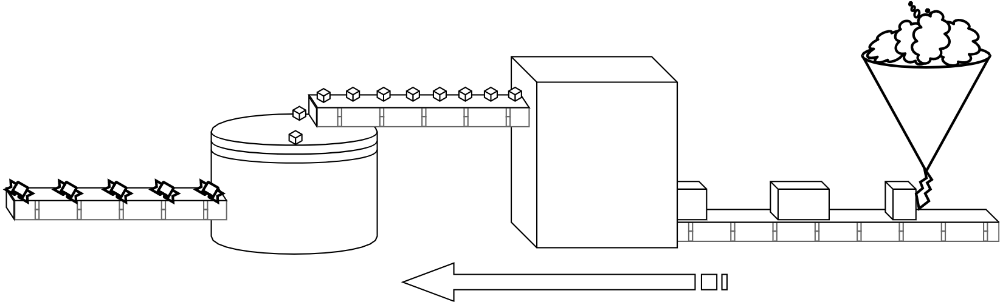
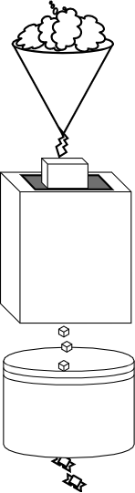
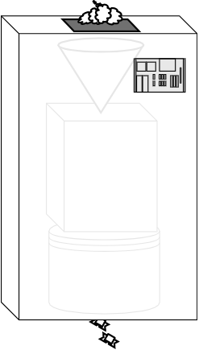
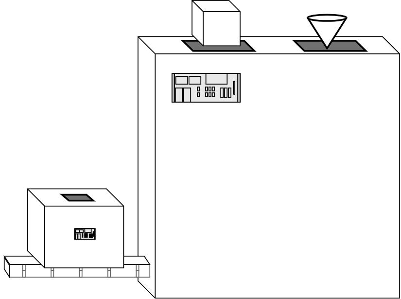
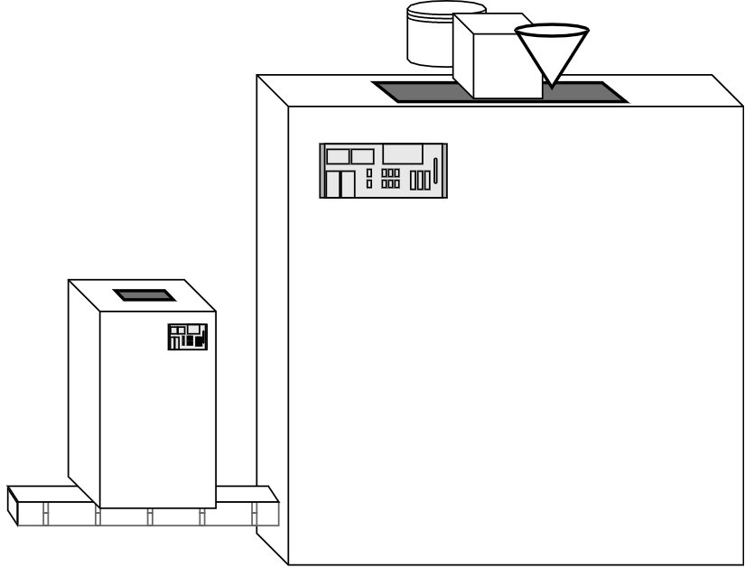

# 章节 4: 组合函数

到目前为止，我希望您对使用函数进行函数编程的含义感到更舒服。

函数式程序员把程序中的每个函数都看作是一个简单的乐高积木。他们一眼就能认出蓝色的2x2砖块，并且确切地知道它是如何工作的，以及他们可以用它做什么。当他们开始建造一个更大、更复杂的乐高模型时，因为他们需要每一块积木，他们已经有了一种本能，从他们的许多备用积木中找出哪一块来。

但有时你把蓝色的2x2块和灰色的4x1块以某种方式放在一起，你会意识到，“这是我经常需要的一块有用的砖”。

所以现在你已经想出了一个新的“片段”，两个其他片段的组合，你现在可以在任何你需要的时候得到这种片段。识别并在需要的地方使用这种蓝灰色的复合l形砖要比每次单独考虑组装两个单独的砖更有效。

函数有各种形状和大小。我们可以定义它们的特定组合来创建一个新的复合函数，这个函数在程序的各个部分都很方便。将函数一起使用的过程称为组合。

组合是指函数编程人员如何对程序中的数据流建模。从某种意义上说，它是函数编程中最基本的概念，因为没有它，您就不能声明性地对数据和状态更改建模。换句话说，如果没有组分，函数编程中的其他所有东西都会崩溃。

## 输出到输入

我们已经看到了一些合成的例子。例如，我们在第3章中讨论[`unary(..)`](ch3.md/#user-content-unary)时包含了这样一个表达式:[' [..].map(unary(parseInt))](ch3.md/#user-content-mapunary)。想想发生了什么。

要将两个函数组合在一起，请将第一个函数调用的输出作为第二个函数调用的输入。在`map(unary(parseInt))`中，`unary(parseInt)`调用返回一个值(一个函数);该值直接作为参数传递给 `map(..)`，后者返回一个数组。

后退一步考虑并结合可视化数据的概念流:

```txt
arrayValue <-- map <-- unary <-- parseInt
```

`parseInt` 是`unary(..)`的输入值. `unary(..)` 的输出值是`map(..)`的输入值. `map(..)` 的输出值是 `arrayValue`. 这就是 `map(..)` 与 `unary(..)`的组合.

**注意:**这里的从右到左的方向是有意这样的，尽管在您的学习过程中这一点可能看起来很奇怪。我们稍后会详细解释。

把这个数据流想象成糖果工厂的传送带，每个操作都是冷却、切割和包装糖果过程中的一个步骤。我们将在本章中使用糖果工厂的比喻来解释什么是组合。

<p align="center">
    
</p>

让我们一步一步地研究一下实际的作文。考虑一下您的程序中可能具有的这两个实用程序:

```js
function words(str) {
    return String( str )
        .toLowerCase()
        .split( /\s|\b/ )
        .filter( function alpha(v){
            return /^[\w]+$/.test( v );
        } );
}

function unique(list) {
    var uniqList = [];

    for (let v of list) {
        // value not yet in the new list?
        if (uniqList.indexOf( v ) === -1 ) {
            uniqList.push( v );
        }
    }

    return uniqList;
}
```

`words(..)`将字符串分割成单词数组。`unique(..)`获取一个单词列表，并对其进行筛选，使其不包含任何重复的单词。

要使用这两个实用程序来分析一段文本字符串:

```js
var text = "To compose two functions together, pass the \
output of the first function call as the input of the \
second function call.";

var wordsFound = words( text );
var wordsUsed = unique( wordsFound );

wordsUsed;
// ["to","compose","two","functions","together","pass",
// "the","output","of","first","function","call","as",
// "input","second"]
```

我们将`words(..)`的数组输出命名为`wordsFound`。`unique(..)`的输入也是一个数组，因此我们可以将 `wordsFound`传递给它。

回到糖果工厂的装配线:第一台机器将融化的巧克力作为“输入”，它的“输出”是一块成形并冷却的巧克力。下一台机器沿着装配线向下一点，它的“输入”是一块巧克力，“输出”是一块切碎的巧克力糖。接下来，生产线上的一台机器从传送带上取下小块巧克力糖，并输出包装好的糖果，准备打包运输。



糖果工厂在这一过程中相当成功，但与所有企业一样，管理层一直在寻找增长的途径。

为了满足更多糖果生产的需求，他们决定拿出传送带装置，把三台机器一台台叠起来，其中一台的输出阀直接连接到下一台的输入阀上。再也不会有大块巧克力在传送带上缓慢而嘈杂地从一台机器传到另一台机器的浪费空间了。

这一创新为工厂节省了很多空间，所以管理层很高兴他们能每天生产更多的糖果!

与此改进的糖果生产配置等价的代码是跳过中间步骤(前面代码片段中的`wordsFound`变量)，只使用两个函数调用:

```js
var wordsUsed = unique( words( text ) );
```

**注意:**虽然我们通常从左到右读取函数调用`unique(..)`和`words(..)`，但是操作的顺序实际上会从右到左，或者从内到外。首先运行`words(..)`，然后运行`unique(..)`。稍后，我们将讨论一种模式，它将执行顺序与从左到右的自然读取匹配，称为`pipe(..)`。

堆叠的机器工作得很好，但是到处都挂着电线有点笨重。他们创建的机器栈越多，工厂的地板就越杂乱。组装和维护所有这些机器堆栈的工作非常耗时。



一天早上，糖果厂的一位工程师有了一个好主意。她认为如果她做一个外部盒子来隐藏所有的电线会更有效率;在内部，所有的三个机器都连接在一起，而在外部，一切都是干净整洁的。在这台新机器的顶部是一个阀门，可以将融化的巧克力倒入机器，底部是一个阀门，可以吐出包装好的巧克力糖果。这样太棒了!

这台单台复合机器更容易移动和安装在工厂需要的任何地方。工厂里的工人们更开心，因为他们不再需要摆弄三台机器上的按钮和刻度盘;他们很快就喜欢用单台花哨的机器。

与代码相关:我们现在意识到`words(..)` 和 `unique(..)`以特定的执行顺序(想想:复合乐高)的配对可以在应用程序的其他几个部分中使用。所以，让我们定义一个复合函数来组合它们:

```js
function uniqueWords(str) {
    return unique( words( str ) );
}
```

`uniqueWords(..)` 接受一个字符串并返回一个数组。它由两个函数组成:`unique(..)` 和 `words(..)`;它创建了这个数据流:

```txt
wordsUsed <-- unique <-- words <-- text
```

您现在可能已经认识到:糖果工厂设计中正在展开的革命是功能组合。

### 机器制造

糖果厂生意兴隆，由于节省了不少空间，他们现在有足够的空间来尝试制造新型糖果。在早期成功的基础上，管理层热衷于不断为他们不断增长的糖果品种发明新的神奇的复合机器。

但是工厂的工程师们很难跟上步伐，因为每次需要制造一种新型的高级复合机器时，他们都要花费相当多的时间来制造新的外箱，并将各个机器安装到其中。

因此，工厂的工程师联系一个工业机器供应商寻求帮助。他们惊奇地发现这个供应商提供**机器制造**机器!听起来不可思议的是，他们购买了一台机器，可以把工厂里的几台较小的机器——比如冷却巧克力的机器和切割巧克力的机器——自动连接起来，甚至用一个干净的大盒子把它们包起来。这一定会使糖果厂真正腾飞!

<p align="center">
    
</p>

回到代码领域，让我们考虑一个名为`compose2(..)`的实用程序，它自动创建两个函数的组合，与我们手动创建的方法完全相同:

```js
function compose2(fn2,fn1) {
    return function composed(origValue){
        return fn2( fn1( origValue ) );
    };
}

// ES6 箭头格式
var compose2 =
    (fn2,fn1) =>
        origValue =>
            fn2( fn1( origValue ) );
```

您是否注意到，我们将参数顺序定义为`fn2,fn1`，而且它是第一个运行的第二个列出的函数(又名`fn1`参数名)，然后是第一个列出的函数(`fn2`)?换句话说，函数从右到左组成。

这似乎是一个奇怪的选择，但有一些原因。大多数典型的FP库都将它们的`compose(..)`定义为按顺序从右向左工作，所以我们坚持这个约定。

但是为什么呢?我认为最简单的解释(但可能不是历史上最准确的解释)是，我们列出它们是为了匹配手工编写代码的顺序，或者更确切地说，是从左到右阅读时遇到的顺序。

`unique(words(str))` 以从左到右的顺序列出函数`unique, words`，因此我们让我们的`compose2(..)`实用程序也按这个顺序接收它们。执行顺序是从右到左，但是代码顺序是从左到右。密切关注那些在你脑海中清晰的东西。

现在，对糖果机更有效的定义是:

```js
var uniqueWords = compose2( unique, words );
```

### 成分变异

看起来`<-- unique <-- words`组合是这两个函数可以组合的惟一顺序。但实际上我们可以把它们按相反的顺序组合在一起，从而创建一个具有不同用途的实用程序:

```js
var letters = compose2( words, unique );

var chars = letters( "How are you Henry?" );
chars;
// ["h","o","w","a","r","e","y","u","n"]
```

这是因为`words(..)` 实用程序出于值类型安全的考虑，首先使用`String(..)`将其输入强制转换为字符串。因此，`unique(..)`返回的数组——现在是`words(..)`的输入——变成了字符串`"H,o,w, ,a,r,e,y,u,n,?"`，然后`words(..)`中的其他行为将处理该字符串到 `chars` 数组中。

诚然，这是一个人为的例子。但重点是函数组合并不总是单向的。有时我们把灰砖放在蓝砖的上面，有时我们把蓝砖放在上面。

糖果工厂最好小心，如果他们试图把包装好的糖果放进机器，混合和冷却巧克力!

## 一般组成

如果我们能定义两个函数的组合，我们就可以继续支持组合任意数量的函数。组成的任意数量函数的常规数据可视化流如下所示：

```txt
finalValue <-- func1 <-- func2 <-- ... <-- funcN <-- origValue
```

<p align="center">
    
</p>

现在糖果厂拥有所有机器中最好的一台:这台机器可以取任意数量的独立的小机器，然后吐出一台大而别致的机器，按顺序执行每一步。这可真是个糖果店啊!这是威利·旺卡的梦想!

我们可以实现一个通用的 `compose(..)` 实用程序如下:

<a name="generalcompose"></a>

```js
function compose(...fns) {
    return function composed(result){
        // copy the array of functions
        var list = [...fns];

        while (list.length > 0) {
            // take the last function off the end of the list
            // and execute it
            result = list.pop()( result );
        }

        return result;
    };
}

// ES6 箭头格式
var compose =
    (...fns) =>
        result => {
            var list = [...fns];

            while (list.length > 0) {
                // take the last function off the end of the list
                // and execute it
                result = list.pop()( result );
            }

            return result;
        };
```

**警告：**`fns` 是一个集合的参数数组，不是传入的数组，因此 `compose(..)`是本地的。可能会有人认为 `[...fns]` 是不必要的。但是，在这个特定的实现中，内部的`composed(..)`函数中的`.pop()`正在改变列表，因此如果我们每次都不进行复制，则返回的 `composed(..)` 函数只能可靠地使用一次。我们将在[Chapter 6](ch6.md/#user-content-hiddenmutation)中重新讨论此危害。

现在我们来看一个组成两个以上函数的例子。回顾我们的`uniqueWords(..)` 组合示例，让我们在组合中添加一个`skipShortWords(..)`：

```js
function skipShortWords(words) {
    var filteredWords = [];

    for (let word of words) {
        if (word.length > 4) {
            filteredWords.push( word );
        }
    }

    return filteredWords;
}
```

让我们定义 `biggerWords(..)`，其中包括`skipShortWords(..)`。手动合成相当于`skipShortWords( unique( words( text ) ) )`，所以让我们用`compose(..)`来实现:

```js
var text = "To compose two functions together, pass the \
output of the first function call as the input of the \
second function call.";

var biggerWords = compose( skipShortWords, unique, words );

var wordsUsed = biggerWords( text );

wordsUsed;
// ["compose","functions","together","output","first",
// "function","input","second"]
```

要对组合做一些更有趣的事情，让我们使用这是我们在第3章中首先看到的[`partialRight(..)`](ch3.md/#user-content-partialright)。我们可以构建一个`compose(..)`本身的函数式编程中局部应用，预先指定第二个和第三个参数(`unique(..)` 和 `words(..)`;我们将其称为`filterWords(..)`。

然后，我们可以通过调用`filterWords(..)`多次完成合成，但分别使用不同的第一个参数：

```js
// 注意：使用`<=4'检查而不是`>4'检查
// `skipShortWords(..)` 使用
function skipLongWords(list) { /* .. */ }

var filterWords = partialRight( compose, unique, words );

var biggerWords = filterWords( skipShortWords );
var shorterWords = filterWords( skipLongWords );

biggerWords( text );
// ["compose","functions","together","output","first",
// "function","input","second"]

shorterWords( text );
// ["to","two","pass","the","of","call","as"]
```

花点时间考虑一下`compose(..)`上正确的部分应用程序给了我们什么。它允许我们提前指定构图的第一步，然后用不同的后续步骤（`biggerWords(..)`和`shorterWords(..)`）创建该构图的特殊变体。这是FP最强大的技巧之一！

您也可以`curry(..)`组合而不是部分应用程序，但是由于从右到左排序，您可能更经常希望`curry( reverseArgs(compose), ..)`而不是仅仅`curry( compose, ..)`本身。

**注意：**因为`curry(..)` （至少[我们在第3章中实现它的方式](ch3.md/#user-content-curry)）依赖于检测元数（`length`）或手动指定它，并且`compose(..)` 是一个可变函数，所以需要手动指定预期的元素，如 `curry(.. , 3)`。

### 替代实施

虽然您可能永远不会实现自己的`compose(..)`以在生产中使用，而只是按照提供的方式使用库的实现，但我发现理解它在封面下的工作方式实际上有助于很好地巩固一般的fp概念。

因此，让我们检查一下`compose(..)`的一些不同实现选项。我们还将看到每个实现都有一些优缺点，特别是性能。

我们将在第9章中详细研究[`reduce(..)`](ch9.md/#reduce)，但现在只需知道它将一个列表（数组）缩减为一个有限值。就像一个奇特的环。

例如，如果对一个数字列表（例如`[1,2,3,4,5,6]`）进行加法归约，则会在进行加法运算时循环它们。减法将把`1` 加到`2`，把结果加到`3`，然后把结果加到`4`，依此类推，最终得到`21`。

`compose(..)`的原始版本使用循环并立即计算要传递给下一个调用的作为一个调用的参数。这是一个函数列表的缩减，所以我们可以用`reduce(..)`做同样的事情:

<a name="composereduce"></a>

```js
function compose(...fns) {
    return function composed(result){
        return [...fns].reverse().reduce( function reducer(result,fn){
            return fn( result );
        }, result );
    };
}

// ES6 箭头格式
var compose = (...fns) =>
    result =>
        [...fns].reverse().reduce(
            (result,fn) =>
                fn( result )
            , result
        );
```

**注意:**`compose(..)`的这个实现使用`[...fns].reverse().reduce(..)` 来从右到左减少。我们将在[第9章重温 `compose(..)`](ch9.md/#user-content-composereduceright)中使用`reduceRight(..)`代替。

注意，`reduce(..)` 循环在每次运行最终的`composed(..)`函数时发生，并且每个中间的 `result(..)` 作为下一个调用的输入传递给下一个迭代。

这种实现的优点是代码更加简洁，并且使用了一个众所周知的函数编程结构:`reduce(..)`。这个实现的性能也类似于最初的for循环版本。

但是，这种实现受到限制，因为外部组合函数(也就是组合中的第一个函数)只能接收单个参数。大多数其他实现都将所有参数传递给第一个调用。如果合成中的每个函数都是一元的，这没什么大不了的。但是，如果需要向第一个调用传递多个参数，则需要不同的实现。

为了修正第一次调用的单参数限制，我们仍然可以使用`reduce(..)`，但是会产生一个延迟计算函数包装:

```js
function compose(...fns) {
    return fns.reverse().reduce( function reducer(fn1,fn2){
        return function composed(...args){
            return fn2( fn1( ...args ) );
        };
    } );
}

// ES6 箭头格式
var compose =
    (...fns) =>
        fns.reverse().reduce( (fn1,fn2) =>
            (...args) =>
                fn2( fn1( ...args ) )
        );
```

注意，我们直接返回`reduce(..)`调用的结果，它本身是一个函数，而不是一个计算结果。*那个*函数允许我们传入尽可能多的参数，将它们全部传递到组合中的第一个函数调用，然后在每个后续调用中弹出每个结果。

与计算运行结果并将其作为`reduce(..)`循环进行传递不同，此实现在组合时预先运行一次 `reduce(..)`循环，并延迟所有函数调用计算——称为延迟计算。还原的每个部分结果都是一个依次封装的函数。

当您调用最终的组合函数并提供一个或多个参数时，大型嵌套函数的所有级别，从最内部的调用到最外部的调用，都是反向连续执行的(不是通过循环)。

性能特征可能与以前基于 `reduce(..)`的实现不同。在这里， `reduce(..)`只运行一次，以生成一个大型复合函数，然后这个复合函数调用简单地执行它的所有嵌套函数的每个调用。在前一个版本中，每次调用都会运行`reduce(..)` 。

对于哪种实现更好，您的优势可能会有所不同，但是请记住，后一种实现并不像前一种实现那样在参数计数方面受到限制。

我们还可以使用递归定义`compose(..)`。`compose(fn1,fn2, .. fnN)`看起来像:

```txt
compose( compose(fn1,fn2, .. fnN-1), fnN );
```

**注意:**我们将在[第8章](ch8.md)中更全面地讨论递归，所以如果这种方法看起来令人困惑，现在不要担心。或者，去读那一章，然后回来再读这篇笔记。:)

下面是我们如何用递归实现`compose(..)`:

```js
function compose(...fns) {
    // 完成最后两个参数
    var [ fn1, fn2, ...rest ] = fns.reverse();

    var composedFn = function composed(...args){
        return fn2( fn1( ...args ) );
    };

    if (rest.length == 0) return composedFn;

    return compose( ...rest.reverse(), composedFn );
}

// ES6 箭头格式
var compose =
    (...fns) => {
        // pull off the last two arguments
        var [ fn1, fn2, ...rest ] = fns.reverse();

        var composedFn =
            (...args) =>
                fn2( fn1( ...args ) );

        if (rest.length == 0) return composedFn;

        return compose( ...rest.reverse(), composedFn );
    };
```

我认为递归实现的好处主要是概念性的。我个人发现，用递归的方式考虑重复操作要比在循环中跟踪运行的结果容易得多，所以我更喜欢代码以这种方式来表示它。

另一些人对递归方法更加气馁，把握度会没有那么强。我希望你能做好判断。

## 重新排序组成

我们在前面讨论了标准的`compose(..)`实现了从右到左的顺序。这样做的好处是，以与手动组合时相同的顺序列出参数。

缺点是它们是以执行的相反顺序列出的，这可能会让人感到困惑。使用`partialRight(compose, ..)`来预先指定要在组合中执行*第一个*函数也更尴尬。

相反的顺序，从左到右组合，有一个共同的名称:`pipe(..)`。这个名称据说来自Unix/Linux领域，其中多个程序通过(' | '操作符)将第一个的输出作为第二个的输入串在一起，以此类推(即， `ls -la | grep "foo" | less`)。

`pipe(..)`与`compose(..)`是相同的，只是它按照从左到右的顺序处理函数列表:

```js
function pipe(...fns) {
    return function piped(result){
        var list = [...fns];

        while (list.length > 0) {
            // 从列表中获取第一个函数
            // 然后执行
            result = list.shift()( result );
        }

        return result;
    };
}
```

实际上，我们可以将`pipe(..)`定义为`compose(..)`的参数反转：

```js
var pipe = reverseArgs( compose );
```

That was easy!

Recall this example from general composition earlier:

```js
var biggerWords = compose( skipShortWords, unique, words );
```

To express that with `pipe(..)`, we just reverse the order we list them in:

```js
var biggerWords = pipe( words, unique, skipShortWords );
```

The advantage of `pipe(..)` is that it lists the functions in order of execution, which can sometimes reduce reader confusion. It may be simpler to read the code: `pipe( words, unique, skipShortWords )`, and recognize that it's executing `words(..)` first, then `unique(..)`, and finally `skipShortWords(..)`.

`pipe(..)` is also handy if you're in a situation where you want to partially apply the *first* function(s) that execute. Earlier we did that with right-partial application of `compose(..)`.

Compare:

```js
var filterWords = partialRight( compose, unique, words );

// vs

var filterWords = partial( pipe, words, unique );
```

As you may recall from our first implementation of [`partialRight(..)` in Chapter 3](ch3.md/#user-content-partialright), it uses `reverseArgs(..)` under the covers, just as our `pipe(..)` now does. So we get the same result either way.

*In this specific case*, the slight performance advantage to using `pipe(..)` is, because we're not trying to preserve the right-to-left argument order of `compose(..)`, we don't need to reverse the argument order back, like we do inside `partialRight(..)`. So `partial(pipe, ..)` is a little more efficient here than `partialRight(compose, ..)`.

## Abstraction

Abstraction plays heavily into our reasoning about composition, so let's examine it in more detail.

Similar to how partial application and currying (see [Chapter 3](ch3.md/#some-now-some-later)) allow a progression from generalized to specialized functions, we can abstract by pulling out the generality between two or more tasks. The general part is defined once, so as to avoid repetition. To perform each task's specialization, the general part is parameterized.

For example, consider this (obviously contrived) code:

```js
function saveComment(txt) {
    if (txt != "") {
        comments[comments.length] = txt;
    }
}

function trackEvent(evt) {
    if (evt.name !== undefined) {
        events[evt.name] = evt;
    }
}
```

Both of these utilities are storing a value in a data source. That's the generality. The specialty is that one of them sticks the value at the end of an array, while the other sets the value at a property name of an object.

So let's abstract:

```js
function storeData(store,location,value) {
    store[location] = value;
}

function saveComment(txt) {
    if (txt != "") {
        storeData( comments, comments.length, txt );
    }
}

function trackEvent(evt) {
    if (evt.name !== undefined) {
        storeData( events, evt.name, evt );
    }
}
```

The general task of referencing a property on an object (or array, thanks to JS's convenient operator overloading of `[ ]`) and setting its value is abstracted into its own function `storeData(..)`. While this utility only has a single line of code right now, one could envision other general behavior that was common across both tasks, such as generating a unique numeric ID or storing a timestamp with the value.

If we repeat the common general behavior in multiple places, we run the maintenance risk of changing some instances but forgetting to change others. There's a principle at play in this kind of abstraction, often referred to as "don't repeat yourself" (DRY).

DRY strives to have only one definition in a program for any given task. An alternative aphorism to motivate DRY coding is that programmers are just generally lazy and don't want to do unnecessary work.

Abstraction can be taken too far. Consider:

```js
function conditionallyStoreData(store,location,value,checkFn) {
    if (checkFn( value, store, location )) {
        store[location] = value;
    }
}

function notEmpty(val) { return val != ""; }

function isUndefined(val) { return val === undefined; }

function isPropUndefined(val,obj,prop) {
    return isUndefined( obj[prop] );
}

function saveComment(txt) {
    conditionallyStoreData( comments, comments.length, txt, notEmpty );
}

function trackEvent(evt) {
    conditionallyStoreData( events, evt.name, evt, isPropUndefined );
}
```

In an effort to be DRY and avoid repeating an `if` statement, we moved the conditional into the general abstraction. We also assumed that we *may* have checks for non-empty strings or non-`undefined` values elsewhere in the program in the future, so we might as well DRY those out, too!

This code *is* more DRY, but to an overkill extent. Programmers must be careful to apply the appropriate levels of abstraction to each part of their program, no more, no less.

Regarding our greater discussion of function composition in this chapter, it might seem like its benefit is this kind of DRY abstraction. But let's not jump to that conclusion, because I think composition actually serves a more important purpose in our code.

Moreover, **composition is helpful even if there's only one occurrence of something** (no repetition to DRY out).

### Separation Enables Focus

Aside from generalization vs. specialization, I think there's another more useful definition for abstraction, as revealed by this quote:

> ... abstraction is a process by which the programmer associates a name with a potentially complicated program fragment, which can then be thought of in terms of its purpose of function, rather than in terms of how that function is achieved. By hiding irrelevant details, abstraction reduces conceptual complexity, making it possible for the programmer to focus on a manageable subset of the program text at any particular time.
>
> Michael L. Scott, Programming Language Pragmatics<a href="#user-content-footnote-1"><sup>1</sup></a>

The point this quote makes is that abstraction -- generally, pulling out some piece of code into its own function -- serves the primary purpose of separating apart two pieces of functionality so that it's possible to focus on each piece independently of the other.

Note that abstraction in this sense is not really intended to *hide* details, as if to treat things as black boxes we *never* examine.

In this quote, "irrelevant", in terms of what is hidden, shouldn't be thought of as an absolute qualitative judgement, but rather relative to what you want to focus on at any given moment. In other words, when we separate X from Y, if I want to focus on X, Y is irrelevant at that moment. At another time, if I want to focus on Y, X is irrelevant at that moment.

**We're not abstracting to hide details; we're separating details to improve focus.**

Recall that at the outset of this book I stated that FP's goal is to create code that is more readable and understandable. One effective way of doing that is untangling complected (read: tightly braided, as in strands of rope) code into separate, simpler (read: loosely bound) pieces of code. In that way, the reader isn't distracted by the details of one part while looking for the details of the other part.

Our higher goal is not to implement something only once, as it is with the DRY mindset. As a matter of fact, sometimes we'll actually repeat ourselves in code.

As we [asserted in Chapter 3](ch3.md/#why-currying-and-partial-application), the main goal with abstraction is to implement separate things, separately. We're trying to improve focus, because that improves readability.

By separating two ideas, we insert a semantic boundary between them, which affords us the ability to focus on each side independent of the other. In many cases, that semantic boundary is something like the name of a function. The function's implementation is focused on *how* to compute something, and the call-site using that function by name is focused on *what* to do with its output. We abstract the *how* from the *what* so they are separate and separately reason'able.

Another way of describing this goal is with imperative vs. declarative programming style. Imperative code is primarily concerned with explicitly stating *how* to accomplish a task. Declarative code states *what* the outcome should be, and leaves the implementation to some other responsibility.

Declarative code abstracts the *what* from the *how*. Typically declarative coding is favored in readability over imperative, though no program (except of course machine code 1s and 0s) is ever entirely one or the other. The programmer must seek balance between them.

ES6 added many syntactic affordances that transform old imperative operations into newer declarative forms. Perhaps one of the clearest is destructuring. Destructuring is a pattern for assignment that describes how a compound value (object, array) is taken apart into its constituent values.

Here's an example of array destructuring:

```js
function getData() {
    return [1,2,3,4,5];
}

// imperative
var tmp = getData();
var a = tmp[0];
var b = tmp[3];

// declarative
var [ a ,,, b ] = getData();
```

The *what* is assigning the first value of the array to `a` and the fourth value to `b`. The *how* is getting a reference to the array (`tmp`) and manually referencing indexes `0` and `3` in assignments to `a` and `b`, respectively.

Does the array destructuring *hide* the assignment? Depends on your perspective. I'm asserting that it simply separates the *what* from the *how*. The JS engine still does the assignments, but it prevents you from having to be distracted by *how* it's done.

Instead, you read `[ a ,,, b ] = ..` and can see the assignment pattern merely telling you *what* will happen. Array destructuring is an example of declarative abstraction.

### Composition as Abstraction

What's all this have to do with function composition? Function composition is also declarative abstraction.

Recall the `shorterWords(..)` example from earlier. Let's compare an imperative and declarative definition for it:

```js
// imperative
function shorterWords(text) {
    return skipLongWords( unique( words( text ) ) );
}

// declarative
var shorterWords = compose( skipLongWords, unique, words );
```

The declarative form focuses on the *what* -- these three functions pipe data from a string to a list of shorter words -- and leaves the *how* to the internals of `compose(..)`.

In a bigger sense, the `shorterWords = compose(..)` line explains the *how* for defining a `shorterWords(..)` utility, leaving this declarative line somewhere else in the code to focus only on the *what*:

```js
shorterWords( text );
```

Composition abstracts getting a list of shorter words from the steps it takes to do that.

By contrast, what if we hadn't used composition abstraction?

```js
var wordsFound = words( text );
var uniqueWordsFound = unique( wordsFound );
skipLongWords( uniqueWordsFound );
```

Or even:

```js
skipLongWords( unique( words( text ) ) );
```

Either of these two versions demonstrates a more imperative style as opposed to the prior declarative style. The reader's focus in those two snippets is inextricably tied to the *how* and less on the *what*.

Function composition isn't just about saving code with DRY. Even if the usage of `shorterWords(..)` only occurs in one place -- so there's no repetition to avoid! -- separating the *how* from the *what* still improves our code.

Composition is a powerful tool for abstraction that transforms imperative code into more readable declarative code.

## Revisiting Points

Now that we've thoroughly covered composition (a trick that will be immensely helpful in many areas of FP), let's watch it in action by revisiting point-free style from [Chapter 3, "No Points"](ch3.md/#no-points) with a scenario that's a fair bit more complex to refactor:

```js
// given: ajax( url, data, cb )

var getPerson = partial( ajax, "http://some.api/person" );
var getLastOrder = partial( ajax, "http://some.api/order", { id: -1 } );

getLastOrder( function orderFound(order){
    getPerson( { id: order.personId }, function personFound(person){
        output( person.name );
    } );
} );
```

The "points" we'd like to remove are the `order` and `person` parameter references.

Let's start by trying to get the `person` "point" out of the `personFound(..)` function. To do so, let's first define:

```js
function extractName(person) {
    return person.name;
}
```

Consider that this operation could instead be expressed in generic terms: extracting any property by name off of any object. Let's call such a utility `prop(..)`:

```js
function prop(name,obj) {
    return obj[name];
}

// or the ES6 => form
var prop =
    (name,obj) =>
        obj[name];
```

While we're dealing with object properties, let's also define the opposite utility: `setProp(..)` for setting a property value onto an object.

However, we want to be careful not to just mutate an existing object but rather create a clone of the object to make the change to, and then return it. The reasons for such care will be discussed at length in [Chapter 5](ch5.md).

<a name="setprop"></a>

```js
function setProp(name,obj,val) {
    var o = Object.assign( {}, obj );
    o[name] = val;
    return o;
}
```

Now, to define an `extractName(..)` that pulls a `"name"` property off an object, we'll partially apply `prop(..)`:

```js
var extractName = partial( prop, "name" );
```

**Note:** Don't miss that `extractName(..)` here hasn't actually extracted anything yet. We partially applied `prop(..)` to make a function that's waiting to extract the `"name"` property from whatever object we pass into it. We could also have done it with `curry(prop)("name")`.

Next, let's narrow the focus on our example's nested lookup calls to this:

```js
getLastOrder( function orderFound(order){
    getPerson( { id: order.personId }, outputPersonName );
} );
```

How can we define `outputPersonName(..)`? To visualize what we need, think about the desired flow of data:

```txt
output <-- extractName <-- person
```

`outputPersonName(..)` needs to be a function that takes an (object) value, passes it into `extractName(..)`, then passes that value to `output(..)`.

Hopefully you recognized that as a `compose(..)` operation. So we can define `outputPersonName(..)` as:

```js
var outputPersonName = compose( output, extractName );
```

The `outputPersonName(..)` function we just created is the callback provided to `getPerson(..)`. So we can define a function called `processPerson(..)` that presets the callback argument, using `partialRight(..)`:

```js
var processPerson = partialRight( getPerson, outputPersonName );
```

Let's reconstruct the nested lookups example again with our new function:

```js
getLastOrder( function orderFound(order){
    processPerson( { id: order.personId } );
} );
```

Phew, we're making good progress!

But we need to keep going and remove the `order` "point". The next step is to observe that `personId` can be extracted from an object (like `order`) via `prop(..)`, just like we did with `name` on the `person` object:

```js
var extractPersonId = partial( prop, "personId" );
```

To construct the object (of the form `{ id: .. }`) that needs to be passed to `processPerson(..)`, let's make another utility for wrapping a value in an object at a specified property name, called `makeObjProp(..)`:

```js
function makeObjProp(name,value) {
    return setProp( name, {}, value );
}

// or the ES6 => form
var makeObjProp =
    (name,value) =>
        setProp( name, {}, value );
```

**Tip:** This utility is known as `objOf(..)` in the Ramda library.

Just as we did with `prop(..)` to make `extractName(..)`, we'll partially apply `makeObjProp(..)` to build a function `personData(..)` that makes our data object:

```js
var personData = partial( makeObjProp, "id" );
```

To use `processPerson(..)` to perform the lookup of a person attached to an `order` value, the conceptual flow of data through operations we need is:

```txt
processPerson <-- personData <-- extractPersonId <-- order
```

So we'll just use `compose(..)` again to define a `lookupPerson(..)` utility:

```js
var lookupPerson =
    compose( processPerson, personData, extractPersonId );
```

And... that's it! Putting the whole example back together without any "points":

```js
var getPerson = partial( ajax, "http://some.api/person" );
var getLastOrder =
    partial( ajax, "http://some.api/order", { id: -1 } );

var extractName = partial( prop, "name" );
var outputPersonName = compose( output, extractName );
var processPerson = partialRight( getPerson, outputPersonName );
var personData = partial( makeObjProp, "id" );
var extractPersonId = partial( prop, "personId" );
var lookupPerson =
    compose( processPerson, personData, extractPersonId );

getLastOrder( lookupPerson );
```

Wow. Point-free. And `compose(..)` turned out to be really helpful in two places!

I think in this case, even though the steps to derive our final answer were a bit drawn out, the end result is much more readable code, because we've ended up explicitly calling out each step.

And even if you didn't like seeing/naming all those intermediate steps, you can preserve point-free but wire the expressions together without individual variables:

```js
partial( ajax, "http://some.api/order", { id: -1 } )
(
    compose(
        partialRight(
            partial( ajax, "http://some.api/person" ),
            compose( output, partial( prop, "name" ) )
        ),
        partial( makeObjProp, "id" ),
        partial( prop, "personId" )
    )
);
```

This snippet is less verbose for sure, but I think it's less readable than the previous snippet where each operation is its own variable. Either way, composition helped us with our point-free style.

## Summary

Function composition is a pattern for defining a function that routes the output of one function call into another function call, and its output to another, and so on.

Because JS functions can only return single values, the pattern essentially dictates that all functions in the composition (except perhaps the first called) need to be unary, taking only a single input from the output of the previous function.

Instead of listing out each step as a discrete call in our code, function composition using a utility like `compose(..)` or `pipe(..)` abstracts that implementation detail so the code is more readable, allowing us to focus on *what* the composition will be used to accomplish, not *how* it will be performed.

Composition is declarative data flow, meaning our code describes the flow of data in an explicit, obvious, and readable way.

In many ways, composition is the most important foundational pattern, in large part because it's the only way to route data through our programs aside from using side effects; the next chapter explores why such should be avoided wherever possible.

----

<a name="footnote-1"><sup>1</sup></a>Scott, Michael L. “Chapter 3: Names, Scopes, and Bindings.” Programming Language Pragmatics, 4th ed., Morgan Kaufmann, 2015, pp. 115.
