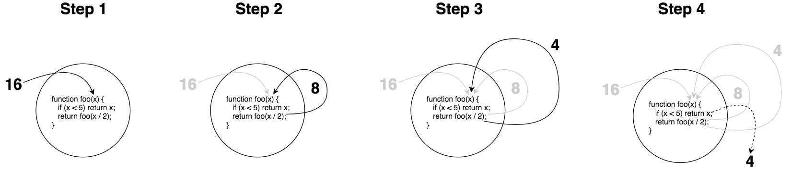
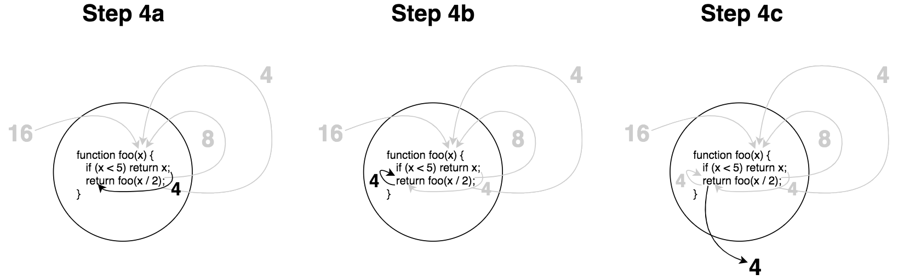
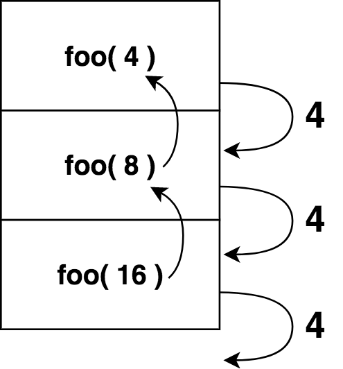
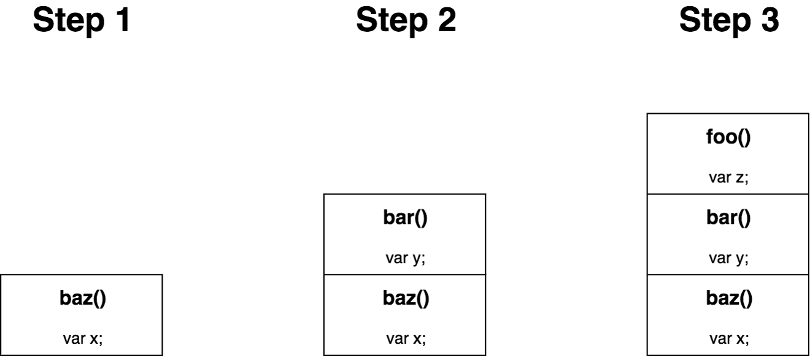
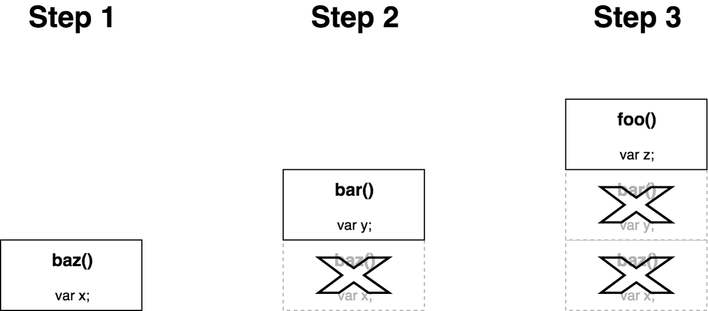

# 章节 8: 递归

你在前一章的闭包/对象了解的怎么样?现在欢迎回来!

下一页，我们将直接进入递归的话题。

<hr>

*(这一页的其余部分故意留白)*

<p>&nbsp;</p>
<p>&nbsp;</p>
<p>&nbsp;</p>
<p>&nbsp;</p>
<p>&nbsp;</p>
<p>&nbsp;</p>
<p>&nbsp;</p>
<p>&nbsp;</p>
<p>&nbsp;</p>
<p>&nbsp;</p>
<p>&nbsp;</p>

<div style="page-break-after: always;"></div>

我们来谈谈递归。在深入讨论之前，请参阅前一页中的正式定义。

我知道这是个蹩脚的笑话。 :)

递归是大多数开发人员都承认非常强大的编程技术之一，但是大多数开发人员也不喜欢使用它。在这个意义上，我把它和正则表达式放在同一个类别。强大，但令人困惑，因此被视为“不值得努力”。

我非常喜欢递归，你也可以!不幸的是，许多递归的例子都集中在一些琐碎的学术任务上，比如生成斐波那契数列。如果你的程序中需要这些数字——让我们面对现实吧，这并不常见!——你可能会错过大局。

事实上，递归是FP开发人员避免命令性循环和重新分配的最重要方法之一，方法是将实现细节转移到语言和引擎中。如果使用得当，递归对于复杂的问题具有强大的声明性。

遗憾的是，递归得到的关注要少得多，尤其是在JS中，这在很大程度上是因为一些非常实际的性能(速度和内存)限制。我们在这一章的目标是深入挖掘，并找到递归应该成为FP的首要和中心的实际原因。

## 定义

递归是当一个函数调用它自己时，这个调用也做同样的事情，这个循环一直持续，直到满足一个基本条件，然后调用循环展开。

**警告:**如果不能确保最终满足基本条件，递归将永远运行，并导致程序崩溃或锁定;基本条件是相当重要的，以得到正确!

但是…那个定义的书面形式太混乱了。我们可以做得更好。考虑这个递归函数:

```js
function foo(x) {
    if (x < 5) return x;
    return foo( x / 2 );
}
```

让我们想象一下当我们调用`foo(16)`时这个函数会发生什么:

<p align="center">
    
</p>

在步骤2中，`x / 2` 生成`8`，并将其作为参数传递给递归的`foo(..)`调用。在步骤3中，同样的事情，`x / 2` 生成 `4`，并作为参数传递给另一个`foo(..)`调用。这部分应该很简单

但有些人可能经常犯错的地方是步骤4。一旦我们满足了`x` (值`4`)为 `< 5` 的基本条件，我们就不再执行任何递归调用，而只是(有效地)执行 `return 4`。具体来说，图中虚线返回的 `4` 简化了这里发生的事情，所以让我们深入研究最后一步，并将其可视化为以下三个子步骤:

<p align="center">
    
</p>

一旦基本条件得到满足，返回的值将通过所有当前函数调用级联返回，最终 `return` 输出最终结果。

另一种可视化这种递归的方法是考虑函数调用的发生顺序(通常称为调用堆栈):

<p align="center">
    
</p>

本章稍后将详细介绍调用堆栈。

另一个递归的例子:

```js
function isPrime(num,divisor = 2){
    if (num < 2 || (num > 2 && num % divisor == 0)) {
        return false;
    }
    if (divisor <= Math.sqrt( num )) {
        return isPrime( num, divisor + 1 );
    }

    return true;
}
```

这个质数检查基本上是通过尝试从`2` 到被检查的`num`的平方根的每个整数来工作的，看看它们中是否有一个被均匀地除(`%` mod返回 `0`)到这个数字。如果有的话，它不是质数。否则，它必须是质数。`divisor + 1` 使用递归遍历每个可能的“除数”值。

递归最著名的例子之一是计算斐波那契数列，其中序列定义为:

```txt
fib( 0 ): 0
fib( 1 ): 1
fib( n ):
    fib( n - 2 ) + fib( n - 1 )
```

**注意:**这个序列的前几个数字是:0、1、1、2、3、5、8、13、21、34、…每个数字都是序列中前两个数字的加法。

Fibonacci（斐波那契）的定义直接用代码表示:

```js
function fib(n) {
    if (n <= 1) return n;
    return fib( n - 2 ) + fib( n - 1 );
}
```

`fib(..)` 两次递归地调用自己，通常称为二进制递归。稍后我们会详细讨论二进制递归。

我们将在本章中多次使用`fib(..)`来说明递归的概念，但是这种特殊形式的一个缺点是有大量的重复工作。`fib(n-1)` 和 `fib(n-2)` 彼此之间没有任何工作，但几乎完全重叠，在整个整数空间直到`0`。

我们在[第5章，“性能效果”](ch5.md/#performance-effects)中简要介绍了记忆法。在这里，记忆可以让任何给定数字的`fib(..)`只计算一次，而不是多次重新计算。我们不会在这里深入讨论这个主题，但是对于任何算法，无论是否递归，都要记住性能警告。

### 相互递归调用

当一个函数调用它自己时，这被称为直接递归。这就是我们在前一节中看到的`foo(..)`, `isPrime(..)`和 `fib(..)`。当两个或多个函数在递归循环中相互调用时，这称为互递归。

这两个函数是相互递归的:

```js
function isOdd(v) {
    if (v === 0) return false;
    return isEven( Math.abs( v ) - 1 );
}

function isEven(v) {
    if (v === 0) return true;
    return isOdd( Math.abs( v ) - 1 );
}
```

是的，这是一个愚蠢的方法来计算一个数字是奇数还是偶数。但它说明了某些算法可以用相互递归来定义。

回想一下前一节中的二进制递归`fib(..)`;我们可以用相互递归来表示:

```js
function fib_(n) {
    if (n == 1) return 1;
    else return fib( n - 2 );
}

function fib(n) {
    if (n == 0) return 0;
    else return fib( n - 1 ) + fib_( n );
}
```

注:这个相互递归的`fib(..)`实现改编自《[使用互递归的斐波那契数]》(https://www.researchgate.net/publication/246180510_Fibonacci_Numbers_Using_Mutual_Recursion)中的研究。

虽然这些相互递归的例子有些做作，但是在更复杂的用例中，相互递归可能非常有用。计算树数据结构中的叶子数是一个例子，而递归下降解析(由编译器对源代码进行解析)是另一个例子。

### 为什么递归?

既然我们已经定义并演示了递归，我们应该检查一下它为什么有用。

递归之所以符合FP的精神，最常被引用的原因是它用调用堆栈上的隐式状态与显式状态跟踪(大部分)进行了交换。通常，当问题需要条件分支和回溯时，递归是最有用的，并且在纯迭代环境中管理这种状态可能非常棘手;至少，代码是非常必要的，并且更难阅读和验证。但是，将每个级别的分支作为调用堆栈上自己的范围进行跟踪，通常会显著提高代码的可读性。

简单的迭代算法可以简单地表示为递归:

```js
function sum(total,...nums) {
    for (let num of nums) {
        total = total + num;
    }

    return total;
}

// 对比

function sum(num1,...nums) {
    if (nums.length == 0) return num1;
    return num1 + sum( ...nums );
}
```

这不仅是因为“for”循环被调用堆栈取代，而且增量部分和(`total`的间歇状态)通过调用堆栈的`return`隐式跟踪，而不是在每次迭代中重新分配`total`。函数编程者通常倾向于避免在可能避免的地方重新分配局部变量。

在类似于这种求和的基本算法中，这种差别很小，很细微。但是，您的算法越复杂，您就越有可能看到递归优势而不是强制状态跟踪的好处。

## 声明式递归

数学家使用*Σ*符号作为一个占位符代表的总和一个数字列表。他们这样做的主要原因是，如果他们处理的是更复杂的公式，并且他们必须手工写出求和，比如`1 + 3 + 5 + 7 + 9 + ..`，那么这会更麻烦(而且可读性更差!)使用这个符号是声明式数学!

递归是声明性算法在同样的意义上,*Σ*是数学的声明。递归表示存在一个问题解决方案，但并不一定要求代码的读者理解该解决方案是如何工作的。让我们考虑两种方法来找到作为参数传递的最高偶数:

```js
function maxEven(...nums) {
    var maxNum = -Infinity;

    for (let num of nums) {
        if (num % 2 == 0 && num > maxNum) {
            maxNum = num;
        }
    }

    if (maxNum !== -Infinity) {
        return maxNum;
    }
}
```

这种实现并不是特别棘手，但是它的细微差别也不是很明显。`maxEven()`, `maxEven(1)`和' maxEven(1,13) '都返回`undefined`，这很明显为什么最后的`if`声明是必要的?

让我们考虑一个递归方法来进行比较。我们不能这样做递归:

```txt
maxEven( nums ):
    maxEven( nums.0, maxEven( ...nums.1 ) )
```

换句话说，我们可以将一组数的最大值-偶数定义为第一个数的最大值-偶数与其余数的最大值-偶数的比较。例如:

```txt
maxEven( 1, 10, 3, 2 ):
    maxEven( 1, maxEven( 10, maxEven( 3, maxEven( 2 ) ) )
```

要在JS中实现这个递归定义，一种方法是:

```js
function maxEven(num1,...restNums) {
    var maxRest = restNums.length > 0 ?
            maxEven( ...restNums ) :
            undefined;

    return (num1 % 2 != 0 || num1 < maxRest) ?
        maxRest :
        num1;
}
```

那么这种方法有什么优势呢?

首先，方法与以前略有不同。我故意将`num1`作为第一个参数名，将其余的参数收集到`restNums`中。但是为什么呢?我们可以将它们全部收集到一个`nums`数组中，然后引用`nums[0]`。

这个函数签名是递归定义的一个有意的提示。它是这样写的:

```txt
maxEven( num1, ...restNums ):
    maxEven( num1, maxEven( ...restNums ) )
```

你看到签名和递归定义之间的对称性了吗?

当我们可以使递归定义更明显，甚至在函数签名，我们提高了函数的声明性。如果我们能将递归定义从签名映射到函数体，它会变得更好。

但我想说，最明显的改进是抑制了“for”循环的干扰。所有循环逻辑都抽象到递归调用堆栈中，这样代码就不会混乱。然后我们就可以自由地把注意力集中在寻找最大值的逻辑上——即使是一次比较两个数字——无论如何，这是最重要的部分!

在精神上，发生的事情类似于数学家在一个更大的方程中使用**∑**和。说的是，列表中的最大偶数是由`maxEven(...restNums)`计算的，所以我们假设这一部分并继续。

此外，我们使用`restNums.length > 0`保护来加强这一概念，因为如果没有更多的数字需要考虑，自然的结果是`maxRest`必须是`undefined`的。我们不需要对推理的那一部分投入任何额外的精神关注。这个基本条件（不再考虑数字）是显而易见的。

接下来，我们将注意力转向检查`num1`与`maxRest`之间的关系——算法的主要逻辑是如何确定两个数字中哪个是最大偶数(如果有的话)。如果`num1`不是偶数(`num1 % 2 != 0`)，或者它小于`maxRest`，那么`maxRest` 会被`return`，即使它是`undefined`。否则，`num1` 就是答案。

我要说明的是，在阅读实现时，这种推理比命令式方法更直观，很少有细微差别或干扰;它比for循环的`-Infinity`版本更具有声明性。

提示:我们应该指出，除了手动迭代或递归之外，另一种(可能更好的)建模方法是使用列表操作(参见[章节 9](ch9.md)，使用`filter(..)`只包含偶数，然后使用`reduce(..)`来找到最大值。我们只是用这个例子来说明递归在手工迭代中的声明性。

### 二叉树递归

下面是另一个递归例子:计算二叉树的深度。实际上，几乎所有使用树的操作都是通过递归最容易实现的，因为手动上下跟踪堆栈是非常必要的，而且容易出错。

二叉树的深度是沿着树的节点向下(左或右)的最长路径。另一种定义方法是递归的——树在任何节点的深度都是1(当前节点)加上它的左子树或右子树的深度:

```txt
depth( node ):
    1 + max( depth( node.left ), depth( node.right ) )
```

Translating that straightforwardly to a binary recursive function:

```js
function depth(node) {
    if (node) {
        let depthLeft = depth( node.left );
        let depthRight = depth( node.right );
        return 1 + max( depthLeft, depthRight );
    }

    return 0;
}
```

我不打算列出这个算法的命令式，但是相信我，它要复杂得多。这种递归方法具有良好的声明性。它严格遵循算法的递归定义，几乎没有干扰。

并不是所有的问题都是干净的递归的。这并不是你应该在任何地方使用的灵丹妙药。但是递归可以非常有效地将问题的表达式从命令式演化为更声明式。

## 栈

让我们回顾一下前面的`isOdd(..)`/`isEven(..)`递归:

```js
function isOdd(v) {
    if (v === 0) return false;
    return isEven( Math.abs( v ) - 1 );
}

function isEven(v) {
    if (v === 0) return true;
    return isOdd( Math.abs( v ) - 1 );
}
```

在大多数浏览器中，如果你尝试这个，你会得到一个错误:

```js
isOdd( 33333 );         // RangeError: Maximum call stack size exceeded
```

这个错误是怎么回事?引擎抛出此错误，因为它试图保护您的程序不运行系统内存不足。为了解释这一点，我们需要了解一下当函数调用发生时JS引擎中发生了什么。

每个函数调用都会留出一小块内存，称为堆栈帧。堆栈框架包含关于函数中处理语句当前状态的某些重要信息，包括任何变量中的值。此信息需要存储在内存中(在堆栈框架中)的原因是，函数可能会调用另一个函数，该函数将暂停当前函数。当其他函数完成时，引擎需要恢复暂停时的确切状态。

当第二个函数调用开始时，它也需要一个堆栈帧，使计数变为2。如果该函数调用另一个堆栈帧，则需要第三个堆栈帧。等等。单词“stack”表示每次从前一个函数调用一个函数时，下一个帧都被“堆叠”在上面。当一个函数调用结束时，它的帧从堆栈中弹出。

考虑一下这个程序:

```js
function foo() {
    var z = "foo!";
}

function bar() {
    var y = "bar!";
    foo();
}

function baz() {
    var x = "baz!";
    bar();
}

baz();
```

逐步可视化该程序的堆栈帧:

<p align="center">
    
</p>

注:如果这些函数没有互相调用，而是按顺序调用——比如`baz(); bar(); foo();`，其中每一个帧都在下一个帧开始之前结束——帧不会叠起来;每个函数调用结束并在添加下一个函数之前从堆栈中删除它的帧。

每个函数调用都需要一点内存。在大多数正常的程序条件下没什么大不了的，对吧?但一旦引入递归，它很快就会成为一个大问题。虽然您几乎肯定不会将不同函数的数千(甚至数百!)个调用手工堆叠在一个调用堆栈中，但是您很容易看到数万或更多递归调用堆叠在一起。

`isOdd(..)`/`isEven(..)`配对会抛出一个`RangeError`，因为当引擎认为调用堆栈增长太多，应该停止时，它会以一个任意的限制介入。这可能不是基于实际内存水平接近于零的限制，而是引擎的一个预测，即如果让这类程序继续运行，内存使用将会失控。要知道或证明一个程序最终会停止是不可能的，因此引擎必须做出有根据的猜测。

这个限制依赖于实现。规范根本没有说明它，所以它不是“必需的”。但实际上所有的JS引擎都有一个限制，因为没有限制将创建一个不稳定的设备，很容易编写不好或恶意代码。每个不同设备环境中的每个引擎都将执行自己的限制，因此无法预测或保证我们可以在多大程度上运行函数调用堆栈。

对于开发人员来说，这个限制意味着递归在解决非平凡大小的数据集上的问题时的实用性存在实际限制。事实上，我认为这种限制可能是递归成为开发人员工具箱中的二等公民的最大原因。遗憾的是，递归是事后才想到的，而不是主要的技术。

### 末尾调用

递归远远早于JS，这些内存限制也是如此。早在20世纪60年代，开发人员就希望使用递归，并在其功能强大的计算机的设备内存的硬限制下运行，这些内存远远低于我们今天的手表。

幸运的是，早期的一项强有力的观察仍然带来了希望。这种技术称为“末尾调用”。

其思想是，如果函数`baz()`对函数`bar()`的调用发生在函数`baz()`执行的末尾——称为末尾调用——那么就不再需要`baz()`的堆栈帧了。这意味着要么可以回收内存，要么可以更好地重用内存来处理函数`bar()`的执行。可视化:

<p align="center">
    
</p>

末尾调用本身并没有真正与递归直接相关;这个概念适用于任何函数调用。但是在大多数情况下，手动非递归调用栈的深度不太可能超过10个级别，因此末尾调用影响程序内存占用的几率非常低。

末尾调用在递归情况下非常出色，因为它意味着递归堆栈可以“永远”运行，惟一的性能问题是计算，而不是固定的内存限制。尾调用递归可以运行在`O(1)`固定内存使用。

这类技术通常称为末尾调用优化(Tail Call optimization, TCO)，但重要的是要区分检测要在固定内存空间中运行的末尾调用的能力和优化此方法的技术。从技术上讲，tail调用本身并不是大多数人认为的性能优化，因为它们实际上可能比正常调用运行得慢。TCO是关于优化末尾调用以更有效地运行。

### 正确的末尾调用 (PTC)

JavaScript从来没有要求(或禁止)末尾调用，直到ES6。ES6要求对末尾调用(称为适当的末尾调用(PTC))的特定形式的末尾调用进行识别，并保证PTC形式的代码在没有无限制堆栈内存增长的情况下运行。实际上，这意味着如果我们坚持PTC，就不会抛出RangeError。

首先，JavaScript中的PTC需要严格的模式。您应该已经使用了严格模式，但是如果您没有使用严格模式，这是您应该使用严格模式的另一个原因。我提过吗，你应该已经使用严格模式了!?

其次，一个“适当的”尾部调用是这样的:

```js
return foo( .. );
```

换句话说，函数调用是在周围函数中执行的最后一件事，它返回的任何值都显式地`return`。通过这种方式，JS可以绝对保证不再需要当前栈帧。

这些都不是 PTC:

```js
foo();
return;

// 或者

var x = foo( .. );
return x;

// 或者

return 1 + foo( .. );
```

注:一个JS引擎，或者一个智能换行器，*可以*做一些代码重组来处理`var x = foo(); return x;`实际上与`return foo();`相同，这将使它符合PTC的条件。但这不是规范所要求的。

`1 +`部分肯定是在 `foo(..)`完成后处理的，因此堆栈帧必须保持不变。

The `1 +` part is definitely processed *after* `foo(..)` finishes, so the stack frame has to be kept around.

然而, 这样的是 PTC:

```js
return x ? foo( .. ) : bar( .. );
```

在计算了`x`条件之后，将运行`foo(..)`或`bar(..)`，在这两种情况下，返回值总是`return。这就是PTC的形式。

二进制(或多个)递归——如前所述，在每个级别上执行两个(或多个)递归调用——永远不可能完全按原样执行PTC，因为所有递归都必须位于尾部调用位置，以避免堆栈增长;在PTC位置最多只能出现一个递归调用。

前面，我们展示了一个从二进制递归重构到互递归的例子。通过将每个函数调用分割成单独的函数调用，其中每个函数调用分别以PTC的形式表示，可以从一个多递归算法中实现PTC。然而，这种类型的复杂重构高度依赖于场景，并且超出了我们在本文中所能涵盖的范围。

## 重新安排递归

如果您想使用递归，但是您的问题集最终可能增长到超过JS引擎的堆栈限制，那么您需要重新安排递归调用，以利用PTC(或者完全避免嵌套调用)。有几种重构策略可以提供帮助，但当然也有一些需要注意的权衡。

需要注意的是，始终牢记代码可读性是我们整体上最重要的目标。如果递归和这里描述的一些策略的组合导致代码更难读/理解，**不要使用递归**;寻找另一种更易于阅读的方法。

### 更换栈

递归的主要问题是它的内存使用，在函数调用被分派到下一个递归调用迭代时，保持堆栈帧的状态来跟踪函数调用的状态。如果我们能够重新安排递归的用法，使堆栈框架不需要保留，那么我们就可以使用PTC来表示递归，并利用JS引擎对末尾调用的优化处理。

让我们回忆一下前面的求和例子:

```js
function sum(num1,...nums) {
    if (nums.length == 0) return num1;
    return num1 + sum( ...nums );
}
```

这不是PTC形式，因为在递归调用`sum(...nums)` 完成后，`total`变量将添加到该结果中。因此，必须保留堆栈帧，以便在递归的其余部分继续进行时跟踪`total`部分结果。

这种重构策略的关键识别点是，我们可以通过添加*now*而不是*after*来消除对堆栈的依赖，然后将部分结果作为参数转发给递归调用。换句话说，不要将`total`保存在当前函数的堆栈帧中，而是将它推入下一次递归调用的堆栈帧中;这将释放当前堆栈帧，以便删除/重用。

首先，我们可以改变我们的`sum(..)`函数的签名，以获得一个新的第一个参数作为部分结果:

```js
function sum(result,num1,...nums) {
    // ..
}
```

现在，我们应该预先计算`result`和`num1`的加法，并传递下去:

```js
"use strict";

function sum(result,num1,...nums) {
    result = result + num1;
    if (nums.length == 0) return result;
    return sum( result, ...nums );
}
```

现在我们的`sum(..)`已经是PTC格式了!耶!

但是缺点是我们现在已经改变了函数的签名，使得使用它变得更加奇怪。调用者本质上必须将`0`作为第一个参数传递给他们想要求和的其他数字:

```js
sum( /*initialResult=*/0, 3, 1, 17, 94, 8 );        // 123
```

这是不幸的。

通常，人们会通过不同的命名他们的笨拙签名递归函数来解决这个问题，然后定义一个接口函数来隐藏这种笨拙:

```js
"use strict";

function sumRec(result,num1,...nums) {
    result = result + num1;
    if (nums.length == 0) return result;
    return sumRec( result, ...nums );
}

function sum(...nums) {
    return sumRec( /*initialResult=*/0, ...nums );
}

sum( 3, 1, 17, 94, 8 );                             // 123
```

这是更好的。不幸的是，我们现在已经创建了多个函数，而不是一个。有时您会看到开发人员将递归函数“隐藏”为一个内部函数，如下所示:

```js
"use strict";

function sum(...nums) {
    return sumRec( /*initialResult=*/0, ...nums );

    function sumRec(result,num1,...nums) {
        result = result + num1;
        if (nums.length == 0) return result;
        return sumRec( result, ...nums );
    }
}

sum( 3, 1, 17, 94, 8 );                             // 123
```

这里的缺点是，每次调用外部`sum(..)`函数时，我们都会重新创建内部的`sumRec(..)`函数。所以，我们可以回到它们是并排的函数，但是把它们都隐藏在一个生命周期中，并且只暴露我们想要的一个:

```js
"use strict";

var sum = (function IIFE(){

    return function sum(...nums) {
        return sumRec( /*initialResult=*/0, ...nums );
    }

    function sumRec(result,num1,...nums) {
        result = result + num1;
        if (nums.length == 0) return result;
        return sumRec( result, ...nums );
    }

})();

sum( 3, 1, 17, 94, 8 );                             // 123
```

好的，我们已经有了PTC，并且我们已经为`sum(..)`有了一个干净漂亮的签名，它不需要调用者知道我们的实现细节。耶!

但是…哇，我们简单的递归函数现在有很多干扰。可读性确实降低了。至少可以说，这是不幸的。有时候，这是我们能做的最好的了。

幸运的是，在其他一些情况下，比如现在，有一个更好的方法。让我们回到这个版本:

```js
"use strict";

function sum(result,num1,...nums) {
    result = result + num1;
    if (nums.length == 0) return result;
    return sum( result, ...nums );
}

sum( /*initialResult=*/0, 3, 1, 17, 94, 8 );        // 123
```

您可能会注意到，`result`是一个与`num1`类似的数字，这意味着我们总是可以将列表中的第一个数字作为运行总数;这甚至包括第一次通话。我们所需要做的就是重新命名这些参数，以明确这一点:

```js
"use strict";

function sum(num1,num2,...nums) {
    num1 = num1 + num2;
    if (nums.length == 0) return num1;
    return sum( num1, ...nums );
}

sum( 3, 1, 17, 94, 8 );                             // 123
```

太棒了。好多了，是吧?我认为这种模式在声明性/合理性和性能之间取得了很好的平衡。

Let's try refactoring with PTC once more, revisiting our earlier `maxEven(..)` (currently not PTC). We'll observe that similar to keeping the sum as the first argument, we can narrow the list of numbers one at a time, keeping the first argument as the highest even we've come across thus far.

For clarity, the algorithm strategy (similar to what we discussed earlier) we might use:

1. Start by comparing the first two numbers, `num1` and `num2`.
2. Is `num1` even, and is `num1` greater than `num2`? If so, keep `num1`.
3. If `num2` is even, keep it (store in `num1`).
4. Otherwise, fall back to `undefined` (store in `num1`).
5. If there are more `nums` to consider, recursively compare them to `num1`.
6. Finally, just return whatever value is left in `num1`.

Our code can follow these steps almost exactly:

```js
"use strict";

function maxEven(num1,num2,...nums) {
    num1 =
        (num1 % 2 == 0 && !(maxEven( num2 ) > num1)) ?
            num1 :
            (num2 % 2 == 0 ? num2 : undefined);

    return nums.length == 0 ?
        num1 :
        maxEven( num1, ...nums )
}
```

**Note:** The first `maxEven(..)` call is not in PTC position, but because it only passes in `num2`, it only recurses just that one level then returns right back out; this is only a trick to avoid repeating the `%` logic. As such, this call won't increase the growth of the recursive stack, any more than if that call was to an entirely different function. The second `maxEven(..)` call is the legitimate recursive call, and it is in fact in PTC position, meaning our stack won't grow as the recursion proceeds.

It should be repeated that this example is only to illustrate the approach to moving recursion to the PTC form to optimize the stack (memory) usage. The more direct way to express a max-even algorithm might indeed be a filtering of the `nums` list for evens first, followed then by a max bubbling or even a sort.

Refactoring recursion into PTC is admittedly a little intrusive on the simple declarative form, but it still gets the job done reasonably. Unfortunately, some kinds of recursion won't work well even with an interface function, so we'll need different strategies.

### Continuation Passing Style (CPS)

In JavaScript, the word *continuation* is often used to mean a function callback that specifies the next step(s) to execute after a certain function finishes its work. Organizing code so that each function receives another function to execute at its end is referred to as Continuation Passing Style (CPS).

Some forms of recursion cannot practically be refactored to pure PTC, especially multiple recursion. Recall the `fib(..)` function earlier, and even the mutual recursion form we derived. In both cases, there are multiple recursive calls, which effectively defeats PTC memory optimizations.

However, you can perform the first recursive call, and wrap the subsequent recursive calls in a continuation function to pass into that first call. Even though this would mean ultimately many more functions will need to be executed in the stack, as long all of them, continuations included, are in PTC form, stack memory usage will not grow unbounded.

We could do this for `fib(..)`:

```js
"use strict";

function fib(n,cont = identity) {
    if (n <= 1) return cont( n );
    return fib(
        n - 2,
        n2 => fib(
            n - 1,
            n1 => cont( n2 + n1 )
        )
    );
}
```

Pay close attention to what's happening here. First, we default the `cont(..)` continuation function as our [`identity(..)` utility from Chapter 3](ch3.md/#one-on-one); remember, it simply returns whatever is passed to it.

Moreover, not just one but two continuation functions are added to the mix. The first one receives the `n2` argument, which eventually receives the computation of the `fib(n-2)` value. The next inner continuation receives the `n1` argument, which eventually is the `fib(n-1)` value. Once both `n2` and `n1` values are known, they can be added together (`n2 + n1`), and that value is passed along to the next `cont(..)` continuation step.

Perhaps this will help mentally sort out what's going on: just like in the previous discussion when we passed partial results along instead of returning them back after the recursive stack, we're doing the same here, but each step gets wrapped in a continuation, which defers its computation. That trick allows us to perform multiple steps where each is in PTC form.

In static languages, CPS is often an opportunity for tail calls the compiler can automatically identify and rearrange recursive code to take advantage of. Unfortunately, that doesn't really apply to the nature of JS.

In JavaScript, you'd likely need to write the CPS form yourself. It's clunkier, for sure; the declarative notation-like form has certainly been obscured. But overall, this form is still more declarative than the `for`-loop imperative implementation.

**Warning:** One major caveat that should be noted is that in CPS, creating the extra inner continuation functions still consumes memory, but of a different sort. Instead of piling up stack frames, the closures just consume free memory (typically, from the heap). Engines don't seem to apply the `RangeError` limits in these cases, but that doesn't mean your memory usage is fixed in scale.

### Trampolines

Where CPS creates continuations and passes them along, another technique for alleviating memory pressure is called trampolines. In this style of code, CPS-like continuations are created, but instead of passed in, they are shallowly returned.

Instead of functions calling functions, the stack never goes beyond depth of one, because each function just returns the next function that should be called. A loop simply keeps running each returned function until there are no more functions to run.

One advantage with trampolines is you aren't limited to environments that support PTC; another is that each function call is regular, not PTC optimized, so it may run quicker.

Let's sketch out a `trampoline(..)` utility:

```js
function trampoline(fn) {
    return function trampolined(...args) {
        var result = fn( ...args );

        while (typeof result == "function") {
            result = result();
        }

        return result;
    };
}
```

As long as a function is returned, the loop keeps going, executing that function and capturing its return, then checking its type. Once a non-function comes back, the trampoline assumes the function calling is complete, and just gives back the value.

Because each continuation needs to return another continuation, we'll need to use the earlier trick of forward-passing the partial result as an argument. Here's how we could use this utility with our earlier example of summation of a list of numbers:

```js
var sum = trampoline(
    function sum(num1,num2,...nums) {
        num1 = num1 + num2;
        if (nums.length == 0) return num1;
        return () => sum( num1, ...nums );
    }
);

var xs = [];
for (let i=0; i<20000; i++) {
    xs.push( i );
}

sum( ...xs );                   // 199990000
```

The downside is that a trampoline requires you to wrap your recursive function in the trampoline driving function; moreover, just like CPS, closures are created for each continuation. However, unlike CPS, each continuation function returned runs and finishes right away, so the engine won't have to accumulate a growing amount of closure memory while the call stack depth of the problem is exhausted.

Beyond execution and memory performance, the advantage of trampolines over CPS is that they're less intrusive on the declarative recursion form, in that you don't have to change the function signature to receive a continuation function argument. Trampolines are not ideal, but they can be effective in your balancing act between imperative looping code and declarative recursion.

## Summary

Recursion is when a function recursively calls itself. Heh. A recursive definition for recursion. Get it!?

Direct recursion is a function that makes at least one call to itself, and it keeps dispatching to itself until it satisfies a base condition. Multiple recursion (like binary recursion) is when a function calls itself multiple times. Mutual recursion is when two or more functions recursively loop by *mutually* calling each other.

The upside of recursion is that it's more declarative and thus typically more readable. The downside is usually performance, but more memory constraints even than execution speed.

Tail calls alleviate the memory pressure by reusing/discarding stack frames. JavaScript requires strict mode and proper tail calls (PTC) to take advantage of this "optimization". There are several techniques we can mix-n-match to refactor a non-PTC recursive function to PTC form, or at least avoid the memory constraints by flattening the stack.

Remember: recursion should be used to make code more readable. If you misuse or abuse recursion, the readability will end up worse than the imperative form. Don't do that!
