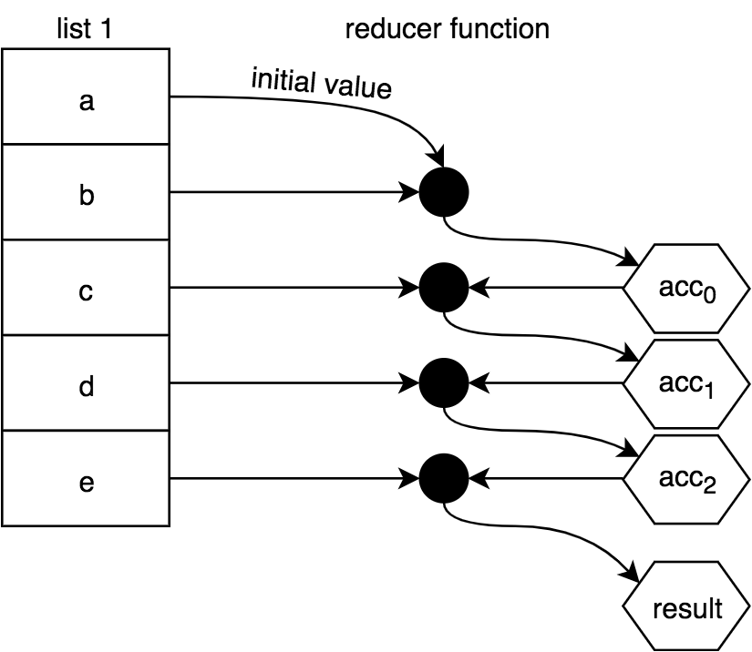

# 章节 9: 列表的操作

> *如果你能做一些很棒的事情，那就不断地去做。*

我们已经在前面的文本中看到了对一些实用程序的简短引用，现在我们想仔细看看这些实用程序，即`map(..)`, `filter(..)`和`reduce(..)`。在JavaScript中，这些实用程序通常用作数组(又名“列表”)原型上的方法，因此我们自然会将它们称为数组或列表操作。

在讨论特定的数组方法之前，我们希望从概念上研究这些操作的用途。在本章中，理解*为什么*列表操作是重要的，就像理解*如何*列表操作一样重要。确保你在阅读这一章的时候记住了这些细节。

这些操作的绝大多数常见插图，无论是在本书之外还是在本章中，都描述了在值列表上执行的琐碎任务(比如将数组中的每个数字加倍);这是一种既便宜又简单的方式。

但是不要忽略了这些简单的例子而忽略了更深层的问题。理解列表操作中一些最重要的FP值来自于能够将一系列任务建模为列表操作，而不是单独执行它们。

这不仅仅是编写更简洁代码的技巧。我们所追求的是将命令式样式转换为声明式样式，使代码模式更易于识别，从而更具可读性。

但还有更重要的东西需要掌握。使用命令式代码，一组计算中的每个中间结果都通过赋值存储在变量中。您的代码所依赖的命令式模式越多，就越难以验证是否存在错误——在逻辑、值的意外突变或隐藏的原因/结果方面。

通过链接和/或组合列表操作，中间结果被隐式地跟踪，并且在很大程度上避免了这些危险。

注:比前几章要多，为了使下面的代码片段尽可能简短，我们将主要使用ES6 `=>`形式。但是，我在[第2章中关于`=>`的建议](ch2.md/#functions-without-function)仍然适用于一般的编码。

## 没有FP的列表处理

作为本章讨论的一个快速序言，我想指出一些操作，它们可能与JavaScript数组和FP列表操作相关，但实际上并不是。这里将不讨论这些操作，因为它们与FP的一般最佳实践不一致:

* `forEach(..)`
* `some(..)`
* `every(..)`

`forEach(..)`是一个迭代助手，但它是为每个函数调用操作的副作用;你可能会猜到为什么这不是我们讨论的FP列表操作!

`some(..)`和`every(..)`确实鼓励使用纯函数(具体地说，谓词函数如`filter(..)`那样)，但它们不可避免地将列表简化为`true`/`false`结果，本质上类似于搜索或匹配。这两个实用程序实际上并不符合我们想要用FP建模代码的模式，所以我们将在这里跳过覆盖它们。

## Map 函数

我们将从最基本的操作之一`map(..)`开始探索FP列表操作。

映射是从一个值到另一个值的转换。例如，如果你从数字`2`开始，然后乘以`3`，你就把它映射成了`6`。需要注意的是，我们讨论的映射转换并不是指“就地”突变或重新分配;相反，我们正在研究如何将转换项目中的新值从一个位置映射到另一个位置。

也就是说，可以:

```js
var x = 2, y;

// 转换/映射
y = x * 3;

// 突变/重新分配
x = x * 3;
```

如果我们为这个乘以`3`定义一个函数，这个函数充当一个映射(transformer)函数:

```js
var multipleBy3 = v => v * 3;

var x = 2, y;

// 转换/映射
y = multiplyBy3( x );
```

我们可以自然地将映射从单个值转换扩展到一个值集合。`map(..)`是一个操作，转换一个列表的所有值，因为它把它们投影到一个新的列表:

<p align="center">
    
</p>

实现 `map(..)`:

```js
function map(mapperFn,arr) {
    var newList = [];

    for (let [idx,v] of arr.entries()) {
        newList.push(
            mapperFn( v, idx, arr )
        );
    }

    return newList;
}
```

注:参数顺序`mapperFn, arr`一开始可能感觉有点倒序，但这种惯例在FP库中更常见，因为它使这些实用程序更容易组合(使用curry)。

 `mapperFn(..)`自然会被传递给列表项来映射/转换，但也会传递一个`idx`和`arr`。我们这样做是为了保持与内置数组`map(..)`的一致性。这些额外的信息在某些情况下非常有用。

 但在其他情况下，您可能希望使用`mapperFn(..)`，只将列表项传递给它，因为额外的参数可能会改变它的行为。在[章节3，"多对一"](ch3.md/#all-for-one)中，我们介绍了`unary(..)`，它限制一个函数只能接受一个参数(不管传递了多少参数)。

回想一下[第3章的例子](ch3.md/#user-content-mapunary)，关于将`parseInt(..)`限制为一个参数来安全地用作`mapperFn(..)`，我们也可以在独立的`map(..)`中使用这个参数:

```js
map( ["1","2","3"], unary( parseInt ) );
// [1,2,3]
```

注: JavaScript数组原型操作(`map(..)`, `filter(..)`, 和 `reduce(..)`)都接受一个可选的最后一个参数，用于函数的`this`绑定。正如我们在[第2章，`this`指向什么](ch2.md/#whats-this)中所讨论的，为了与FP的最佳实践保持一致，基于`this`的编码通常应该尽量避免。因此，本章中的示例实现不支持这种`this`绑定特性。

除了可以对这些值类型的列表执行明显的数字或字符串操作外，这里还有一些映射操作的示例。我们可以使用`map(..)`将函数列表转换为函数返回值列表:

```js
var one = () => 1;
var two = () => 2;
var three = () => 3;

[one,two,three].map( fn => fn() );
// [1,2,3]
```

或者我们可以先转换一个函数列表，将它们与另一个函数组合，然后执行它们:

```js
var increment = v => ++v;
var decrement = v => --v;
var square = v => v * v;

var double = v => v * 2;

[increment,decrement,square]
.map( fn => compose( fn, double ) )
.map( fn => fn( 3 ) );
// [7,5,36]
```

关于`map(..)`需要注意的一些有趣的事情:我们通常会假设列表是从左到右处理的，但是关于`map(..)`的概念却没有真正需要这样做。每个变换都是独立于其它变换的。

一般意义上的映射甚至可以在支持这种方式的环境中并行化，这对于大型列表来说可以极大地提高性能。我们没有看到JavaScript真正这样做，因为它不需要您传递一个纯粹的函数`mapperFn(..)`，即使您**确实应该**。如果您要传递一个非纯函数，而JS要以不同的顺序运行不同的调用，这将很快造成混乱。


尽管从理论上讲，各个映射操作是独立的，但JS必须假设它们不是独立的。

### 同步 VS 异步

我们在本章讨论的列表操作都是对一个已经存在的值列表进行同步操作;`map(..)`在这里是一个迫切的行动。但是另一种考虑映射函数的方法是将其作为一个事件处理程序，它将针对列表中遇到的每个新值调用。

想象一下这样的虚构场景:

```js
var newArr = arr.map();

arr.addEventListener( "value", multiplyBy3 );
```

现在，每当一个值被添加到`arr`中，`multiplyBy3(..)`事件处理程序——mapper函数——就会被该值调用，它的转换也会被添加到`newArr`中。

我们所暗示的是，数组和我们对其执行的数组操作是即时同步版本，而这些相同的操作也可以在“延迟列表”(即流)上建模，该列表会随着时间的推移接收其值。我们将在[第10章](ch10.md)中深入探讨这个主题。

### map vs. each

有些倡导者使用`map(..)`作为`forEach(..)`迭代的一般形式，在本质上，所接收的值是通过非接触传递的，但是可以执行一些中间操作：

```js
[1,2,3,4,5]
.map( function mapperFn(v){
    console.log( v );           // 操作!
    return v;
} )
..
```

这种技术看起来很有用的原因是`map(..)`返回数组，因此您可以在它之后继续链接更多的操作;`forEach(..)`的返回值是`undefined`。但是，我认为您应该避免以这种方式使用`map(..)`，因为以一种决然非FP的方式使用核心FP操作纯粹是混淆。

你应该听过这句老话:正确的工作需要正确的工具，对吧?锤子当钉子，螺丝刀当螺丝钉……这有点不同:它以正确的方式使用了正确的工具。

锤子是用来拿在手里的;如果你把它放在嘴里，试着用锤子敲钉子，你的效果不会很好。`map(..)`的目的是映射值，而不是创建其他操作。


### 函数变量/函子（functor）

在这本书中，我们尽量避免使用FP中杜撰的术语。我们有时会使用官方术语，但大多数情况下，我们可以从日常对话中获得一些意义。

我将非常简短地打破这种模式，使用一个可能有点吓人的单词:函数变量（functor）。我想在这里讨论函子的原因是因为我们现在已经知道它们的作用，因为这个术语在FP的其余文献中被大量使用;的确，函子是FP中的基本概念，它直接来自于数学原理(范畴理论)。你至少要熟悉这个术语，不要害怕，这将是有益的。

函数变量是一个值，它具有对该值使用操作符函数的实用程序，该操作符函数保留组合。

如果所讨论的值是复合的，这意味着它是由单个值组成的——例如，数组就是这种情况!——函子对每个单独的值使用运算符函数。此外，函子实用程序创建一个新的复合值，该值包含所有操作符函数调用的结果。

这是描述我们刚刚看到的`map(..)`的一种奇特的方式。`map(..)`函数接受其关联值(数组)和映射函数(操作符函数)，并对数组中的每个单独值执行映射函数。最后，它返回一个新数组，其中包含所有新映射的值。

另一个例子:一个字符串函子是一个字符串加上一个实用程序，该实用程序跨字符串中的所有字符执行某个操作符函数，返回一个带有处理过的字母的新字符串。想想这个精心设计的例子:

```js
function uppercaseLetter(c) {
    var code = c.charCodeAt( 0 );

    // 小写?
    if (code >= 97 && code <= 122) {
        // 大写!
        code = code - 32;
    }

    return String.fromCharCode( code );
}

function stringMap(mapperFn,str) {
    return [...str].map( mapperFn ).join( "" );
}

stringMap( uppercaseLetter, "Hello World!" );
// HELLO WORLD!
```

`stringMap(..)`允许字符串为函函数。您可以为任何数据结构定义映射函数;只要实用程序遵循这些规则，数据结构就是一个函子。

## Filter 函数

想象一下，我带着一个空篮子去杂货店参观水果区;有一个很大的水果展(苹果、桔子和香蕉)。我真的很饿，所以我想要尽可能多的水果，但我真的只喜欢圆形的水果(苹果和桔子)。所以我一个一个地筛选每一个水果，然后拿着满满一篮子的苹果和桔子走了。

我们称这个过程为“过滤”。你会更自然地把我的购物描述为从一个空的篮子开始，然后**过滤掉**(选择，包括)，只有苹果和桔子，还是从全部展示水果开始，然后**过滤掉**(跳过，不包括)香蕉，因为我的篮子里装满了水果?

如果你在一壶水里煮意大利面，然后把它倒入水槽上方的过滤器，你是过滤意大利面还是过滤水?如果你把咖啡渣放进过滤器里，然后煮一杯咖啡，你是把咖啡渣过滤进杯子里，还是过滤掉咖啡渣?

您的过滤是否取决于您想要的东西是“保留”在过滤器中还是通过过滤器?

如果你在航空公司/酒店网站上指定了“过滤结果”选项，你会怎么做?你是在过滤符合你标准的结果，还是过滤掉所有不符合的结果?请仔细考虑:此示例可能与前面的示例具有不同的语义。

### 过滤的混淆

根据你的观点，过滤要么是排外的，要么是包容的。这种概念上的合并是不幸的。

我认为对于过滤最常见的解释——无论如何，在编程之外——是你过滤掉不需要的东西。不幸的是，在编程中，我们本质上已经将这种语义转换为更像是过滤需要的东西。

`filter(..)`列表操作使用一个函数来决定原始数组中的每个值是否应该在新数组中。如果一个值应该返回`true`，那么这个函数需要返回`true`;如果跳过它，则需要返回`false`。为这种决策返回`true`/`false`的函数有一个特殊的名称:谓语函数。

如果您认为`true`表示一个积极的信号，那么`filter(..)`的定义就是您说“保留”(过滤)一个值，而不是说“丢弃”(过滤)一个值。

要使用`filter(..)`作为排除动作，你必须扭转你的大脑，通过返回`false`来积极地暗示排除，通过返回`true`来被动地让一个值通过。

这种语义上的不匹配之所以重要，是因为您可能会将函数命名为`predicateFn(..)`，以及这对代码的可读性意味着什么。我们稍后会回到这一点。

下面是如何可视化一个`filter(..)`操作列表:

<p align="center">
    
</p>

实现 `filter(..)`:

```js
function filter(predicateFn,arr) {
    var newList = [];

    for (let [idx,v] of arr.entries()) {
        if (predicateFn( v, idx, arr )) {
            newList.push( v );
        }
    }

    return newList;
}
```

注意，就像之前的`mapperFn(..)`一样，`predicateFn(..)`不仅传递了值，还传递了`idx`和`arr`。必要时使用`unary(..)`来限制它的参数。

与`map(..)`一样， `filter(..)`是作为JS数组的内置实用程序提供的。

让我们考虑这样一个谓词函数:

```js
var whatToCallIt = v => v % 2 == 1;
```

这个函数使用`v % 2 == 1`来返回`true`或`false`。这里的效果是，奇数将返回`true`，偶数将返回`false`。这个函数应该叫什么?一个自然的名字可能是:

```js
var isOdd = v => v % 2 == 1;
```

考虑如何使用 `isOdd(..)`与一个简单的值检查在您的代码某处:

```js
var midIdx;

if (isOdd( list.length )) {
    midIdx = (list.length + 1) / 2;
}
else {
    midIdx = list.length / 2;
}
```

很有道理,对吧?但是，让我们考虑使用内置数组`filter(..)`来过滤一个列表的值:

```js
[1,2,3,4,5].filter( isOdd );
// [1,3,5]
```

如果你来描述`[1,3,5]`的结果，你会说“我过滤掉了偶数”，还是说“我过滤掉了奇数”?我认为前者是一种更自然的描述方式。但是代码读取的结果正好相反。从字面上看，这些代码表示我们“过滤了每个奇数”。

我个人觉得这种语义上的混淆。毫无疑问，有经验的开发人员有很多先例。但如果你只是重新开始，这种逻辑表达似乎有点像不带双重否定就不说话——也就是说，带着双重否定说话。

我们可以通过将`isOdd(..)`重命名为`isEven(..)`来简化这个过程:

```js
var isEven = v => v % 2 == 1;

[1,2,3,4,5].filter( isEven );
// [1,3,5]
```

耶!但是这个函数的名称没有任何意义，因为当它是偶数时，它返回`false` :

```js
isEven( 2 );        // false
```

回想一下，在[章节 3， "无参数风格"](ch3.md/#no-points)中，我们定义了一个`not(..)`操作符，它否定谓词函数。考虑:

```js
var isEven = not( isOdd );

isEven( 2 );        // true
```

但是我们不能将这个`isEven(..)`与当前定义的`filter(..)`一起使用，因为我们的逻辑将被颠倒;我们最终会打成平手，而不是赔率。我们需要做的是:

```js
[1,2,3,4,5].filter( not( isEven ) );
// [1,3,5]
```

这完全违背了目的，所以我们不要这样做。我们只是在兜圈子。

### 过滤外 & 过滤里

为了消除所有这些混淆，让我们定义一个`filterOut(..)`，它通过内部否定谓词检查来过滤值。同时，我们将别名`filterIn(..)`到现有的`filter(..)`:

```js
var filterIn = filter;

function filterOut(predicateFn,arr) {
    return filterIn( not( predicateFn ), arr );
}
```

现在我们可以在代码的任何地方选用最合理的过滤器:

```js
isOdd( 3 );                             // true
isEven( 2 );                            // true

filterIn( isOdd, [1,2,3,4,5] );         // [1,3,5]
filterOut( isEven, [1,2,3,4,5] );       // [1,3,5]
```

我认为使用 `filterIn(..)` 和 `filterOut(..)` (在Ramda中称为 `reject(..)` )将使您的代码比仅仅使用 `filter(..)` 更具有可读性，并避免使读者混淆语义。

## Reduce 函数

当 `map(..)` 和 `filter(..)` 生成新列表时，通常第三个操作函数(`reduce(..)`)将列表的值合并(也称为"reduce ")为单个有限(非列表)值，如数字或字符串。但是，在本章的后面，我们将看到如何推动`reduce(..)`以更高级的方式使用它。`reduce(..)`是最重要的FP工具之一;它就像一把瑞士军刀，功能齐全。

组合/约简被抽象地定义为取两个值并使它们成为一个值。有些FP上下文将其称为“折叠”，就好像您将两个值折叠成一个值一样。我认为这是一个很有帮助的形象化。

就像映射和过滤一样，组合的方式完全取决于您，通常取决于列表中值的类型。例如，数字通常通过算术组合，字符串通过连接，函数通过组合。

有时，缩减会指定一个 `initialValue`，并通过将它与列表中的第一个值组合在一起来开始工作，然后通过列表中的其余每个值向下层叠。它是这样的:

<p align="center">
    
</p>

或者，您可以省略`initialValue`，在这种情况下，列表的第一个值将代替`initialValue`，组合将从列表中的第二个值开始，如下所示:

<p align="center">
    
</p>

**警告:**在JavaScript中，如果reduction中没有至少一个值(要么在数组中，要么指定为`initialValue`)，则抛出一个错误。如果在任何情况下减少的列表可能是空的，注意不要忽略`initialValue`。

传递给 `reduce(..)` 以执行还原的函数通常称为减速器。与我们前面看到的映射器和谓词函数不同，减速器具有不同的签名。还原器主要接收当前还原结果以及下一个要还原它的值。每一步还原的当前结果通常称为累加器。（注：reducer 翻译为减速器）

例如，考虑使用' 3 '的 `initialValue` 来减少数字' 5 '、' 10 '和' 15 '所涉及的步骤:

1. `3` * `5` = `15`
2. `15` * `10` = `150`
3. `150` * `15` = `2250`

在JavaScript中表达使用内置的 `reduce(..)` 方法对数组:

```js
[5,10,15].reduce( (product,v) => product * v, 3 );
// 2250
```

但是 `reduce(..)` 的独立实现可能是这样的:

```js
function reduce(reducerFn,initialValue,arr) {
    var acc, startIdx;

    if (arguments.length == 3) {
        acc = initialValue;
        startIdx = 0;
    }
    else if (arr.length > 0) {
        acc = arr[0];
        startIdx = 1;
    }
    else {
        throw new Error( "Must provide at least one value." );
    }

    for (let idx = startIdx; idx < arr.length; idx++) {
        acc = reducerFn( acc, arr[idx], idx, arr );
    }

    return acc;
}
```

Just as with `map(..)` and `filter(..)`, the reducer function is also passed the lesser-common `idx` and `arr` arguments in case that's useful to the reduction. I would say I don't typically use these, but I guess it's nice to have them available.

Recall in [Chapter 4, we discussed the `compose(..)` utility](ch4.md/#user-content-composereduce) and showed an implementation with `reduce(..)`:

```js
function compose(...fns) {
    return function composed(result){
        return [...fns].reverse().reduce( function reducer(result,fn){
            return fn( result );
        }, result );
    };
}
```

To illustrate `reduce(..)`-based composition differently, consider a reducer that will compose functions left-to-right (like `pipe(..)` does), to use in an array chain:

```js
var pipeReducer = (composedFn,fn) => pipe( composedFn, fn );

var fn =
    [3,17,6,4]
    .map( v => n => v * n )
    .reduce( pipeReducer );

fn( 9 );            // 11016  (9 * 3 * 17 * 6 * 4)
fn( 10 );           // 12240  (10 * 3 * 17 * 6 * 4)
```

`pipeReducer(..)` is unfortunately not point-free (see [Chapter 3, "No Points"](ch3.md/#no-points)), but we can't just pass `pipe(..)` as the reducer itself, because it's variadic; the extra arguments (`idx` and `arr`) that `reduce(..)` passes to its reducer function would be problematic.

Earlier we talked about using `unary(..)` to limit a `mapperFn(..)` or `predicateFn(..)` to just a single argument. It might be handy to have a `binary(..)` that does something similar but limits to two arguments, for a `reducerFn(..)` function:

```js
var binary =
    fn =>
        (arg1,arg2) =>
            fn( arg1, arg2 );
```

Using `binary(..)`, our previous example is a little cleaner:

```js
var pipeReducer = binary( pipe );

var fn =
    [3,17,6,4]
    .map( v => n => v * n )
    .reduce( pipeReducer );

fn( 9 );            // 11016  (9 * 3 * 17 * 6 * 4)
fn( 10 );           // 12240  (10 * 3 * 17 * 6 * 4)
```

Unlike `map(..)` and `filter(..)` whose order of passing through the array wouldn't actually matter, `reduce(..)` definitely uses left-to-right processing. If you want to reduce right-to-left, JavaScript provides a `reduceRight(..)`, with all other behaviors the same as `reduce(..)`:

```js
var hyphenate = (str,char) => `${str}-${char}`;

["a","b","c"].reduce( hyphenate );
// "a-b-c"

["a","b","c"].reduceRight( hyphenate );
// "c-b-a"
```

<a name="composereduceright"></a>

Where `reduce(..)` works left-to-right and thus acts naturally like `pipe(..)` in composing functions, `reduceRight(..)`'s right-to-left ordering is natural for performing a `compose(..)`-like operation. So, let's revisit [`compose(..)` from Chapter 4](ch4.md/#user-content-composereduce), but implement it using `reduceRight(..)`:

```js
function compose(...fns) {
    return function composed(result){
        return fns.reduceRight( function reducer(result,fn){
            return fn( result );
        }, result );
    };
}
```

Now, we don't need to do `[...fns].reverse()`; we just reduce from the other direction!

### Map as Reduce

The `map(..)` operation is iterative in its nature, so it can also be represented as a reduction (`reduce(..)`). The trick is to realize that the `initialValue` of `reduce(..)` can be itself an (empty) array, in which case the result of a reduction can be another list!

```js
var double = v => v * 2;

[1,2,3,4,5].map( double );
// [2,4,6,8,10]

[1,2,3,4,5].reduce(
    (list,v) => (
        list.push( double( v ) ),
        list
    ), []
);
// [2,4,6,8,10]
```

<a name="reducecheating"></a>

**Note:** We're cheating with this reducer: using a side effect by allowing `list.push(..)` to mutate the list that was passed in. In general, that's not a good idea, obviously, but since we know the `[]` list is being created and passed in, it's less dangerous. You could be more formal -- yet less performant! -- by creating a new list with the val `concat(..)`d onto the end. We'll come back to [this cheat in Appendix A](apA.md/#user-content-cheating).

Implementing `map(..)` with `reduce(..)` is not on its surface an obvious step or even an improvement. However, this ability will be a crucial recognition for more advanced techniques like those we'll cover in [Appendix A](apA.md).

### Filter as Reduce

Just as `map(..)` can be done with `reduce(..)`, so can `filter(..)`:

```js
var isOdd = v => v % 2 == 1;

[1,2,3,4,5].filter( isOdd );
// [1,3,5]

[1,2,3,4,5].reduce(
    (list,v) => (
        isOdd( v ) ? list.push( v ) : undefined,
        list
    ), []
);
// [1,3,5]
```

**Note:** More impure reducer cheating here. Instead of `list.push(..)`, we could have done `list.concat(..)` and returned the new list. We'll come back to this [cheat in Appendix A](apA.md/#user-content-cheating).

## Advanced List Operations

Now that we feel somewhat comfortable with the foundational list operations `map(..)`, `filter(..)`, and `reduce(..)`, let's look at a few more-sophisticated operations you may find useful in various situations. These are generally utilities you'll find in various FP libraries.

### Unique

Filtering a list to include only unique values, based on `indexOf(..)` searching (which uses `===` strict equality comparison):

```js
var unique =
    arr =>
        arr.filter(
            (v,idx) =>
                arr.indexOf( v ) == idx
        );
```

This technique works by observing that we should only include the first occurrence of an item from `arr` into the new list; when running left-to-right, this will only be true if its `idx` position is the same as the `indexOf(..)` found position.

Another way to implement `unique(..)` is to run through `arr` and include an item into a new (initially empty) list if that item cannot already be found in the new list. For that processing, we use `reduce(..)`:

```js
var unique =
    arr =>
        arr.reduce(
            (list,v) =>
                list.indexOf( v ) == -1 ?
                    ( list.push( v ), list ) : list
        , [] );
```

**Note:** There are many other ways to implement this algorithm using more imperative approaches like loops, and many of them are likely "more efficient" performance-wise. However, the advantage of either of these presented approaches is that they use existing built-in list operations, which makes them easier to chain/compose alongside other list operations. We'll talk more about those concerns later in this chapter.

`unique(..)` nicely produces a new list with no duplicates:

```js
unique( [1,4,7,1,3,1,7,9,2,6,4,0,5,3] );
// [1, 4, 7, 3, 9, 2, 6, 0, 5]
```

### Flatten

From time to time, you may have (or produce through some other operations) an array that's not just a flat list of values -- for instance, it might include nested arrays, as shown here:

```js
[ [1, 2, 3], 4, 5, [6, [7, 8]] ]
```

What if you'd like to transform it as follows?

```js
[ 1, 2, 3, 4, 5, 6, 7, 8 ]
```

The operation we're looking for is typically called `flatten(..)`, and it could be implemented like this using our Swiss Army knife `reduce(..)`:

```js
var flatten =
    arr =>
        arr.reduce(
            (list,v) =>
                list.concat( Array.isArray( v ) ? flatten( v ) : v )
        , [] );
```

**Note:** This implementation choice relies on recursion as we saw in [Chapter 8](ch8.md).

To use `flatten(..)` with an array of arrays (of any nested depth):

```js
flatten( [[0,1],2,3,[4,[5,6,7],[8,[9,[10,[11,12],13]]]]] );
// [0,1,2,3,4,5,6,7,8,9,10,11,12,13]
```

You might like to limit the recursive flattening to a certain depth. We can handle this by adding an optional `depth` limit argument to the implementation:

```js
var flatten =
    (arr,depth = Infinity) =>
        arr.reduce(
            (list,v) =>
                list.concat(
                    depth > 0 ?
                        (depth > 1 && Array.isArray( v ) ?
                            flatten( v, depth - 1 ) :
                            v
                        ) :
                        [v]
                )
        , [] );
```

Illustrating the results with different flattening depths:

```js
flatten( [[0,1],2,3,[4,[5,6,7],[8,[9,[10,[11,12],13]]]]], 0 );
// [[0,1],2,3,[4,[5,6,7],[8,[9,[10,[11,12],13]]]]]

flatten( [[0,1],2,3,[4,[5,6,7],[8,[9,[10,[11,12],13]]]]], 1 );
// [0,1,2,3,4,[5,6,7],[8,[9,[10,[11,12],13]]]]

flatten( [[0,1],2,3,[4,[5,6,7],[8,[9,[10,[11,12],13]]]]], 2 );
// [0,1,2,3,4,5,6,7,8,[9,[10,[11,12],13]]]

flatten( [[0,1],2,3,[4,[5,6,7],[8,[9,[10,[11,12],13]]]]], 3 );
// [0,1,2,3,4,5,6,7,8,9,[10,[11,12],13]]

flatten( [[0,1],2,3,[4,[5,6,7],[8,[9,[10,[11,12],13]]]]], 4 );
// [0,1,2,3,4,5,6,7,8,9,10,[11,12],13]

flatten( [[0,1],2,3,[4,[5,6,7],[8,[9,[10,[11,12],13]]]]], 5 );
// [0,1,2,3,4,5,6,7,8,9,10,11,12,13]
```

#### Mapping, Then Flattening

One of the most common usages of `flatten(..)` behavior is when you've mapped a list of elements where each transformed value from the original list is now itself a list of values. For example:

```js
var firstNames = [
    { name: "Jonathan", variations: [ "John", "Jon", "Jonny" ] },
    { name: "Stephanie", variations: [ "Steph", "Stephy" ] },
    { name: "Frederick", variations: [ "Fred", "Freddy" ] }
];

firstNames
.map( entry => [ entry.name, ...entry.variations ] );
// [ ["Jonathan","John","Jon","Jonny"], ["Stephanie","Steph","Stephy"],
//   ["Frederick","Fred","Freddy"] ]
```

The return value is an array of arrays, which might be more awkward to work with. If we want a single dimension list with all the names, we can then `flatten(..)` that result:

```js
flatten(
    firstNames
    .map( entry => [ entry.name, ...entry.variations ] )
);
// ["Jonathan","John","Jon","Jonny","Stephanie","Steph","Stephy",
//  "Frederick","Fred","Freddy"]
```

Besides being slightly more verbose, the disadvantage of doing the `map(..)` and `flatten(..)` as separate steps is primarily around performance; this approach processes the list twice, and creates an intermediate list that's then thrown away.

FP libraries typically define a `flatMap(..)` (often also called `chain(..)`) that does the mapping-then-flattening combined. For consistency and ease of composition (via currying), the `flatMap(..)` (aka `chain(..)`) utility typically matches the `mapperFn, arr` parameter order that we saw earlier with the standalone `map(..)`, `filter(..)`, and `reduce(..)` utilities:

```js
flatMap( entry => [ entry.name, ...entry.variations ], firstNames );
// ["Jonathan","John","Jon","Jonny","Stephanie","Steph","Stephy",
//  "Frederick","Fred","Freddy"]
```

The naive implementation of `flatMap(..)` with both steps done separately:

<a name="flatmap"></a>

```js
var flatMap =
    (mapperFn,arr) =>
        flatten( arr.map( mapperFn ), 1 );
```

**Note:** We use `1` for the flattening-depth because the typical definition of `flatMap(..)` is that the flattening is shallow on just the first level.

Since this approach still processes the list twice resulting in worse performance, we can combine the operations manually, using `reduce(..)`:

```js
var flatMap =
    (mapperFn,arr) =>
        arr.reduce(
            (list,v) =>
                // note: concat(..) used here since it automatically
                // flattens an array into the concatenation
                list.concat( mapperFn( v ) )
        , [] );
```

While there's some convenience and performance gained with a `flatMap(..)` utility, there may very well be times when you need other operations like `filter(..)`ing mixed in. If that's the case, doing the `map(..)` and `flatten(..)` separately might still be more appropriate.

### Zip

So far, the list operations we've examined have operated on a single list. But some cases will need to process multiple lists. One well-known operation alternates selection of values from each of two input lists into sub-lists, called `zip(..)`:

```js
zip( [1,3,5,7,9], [2,4,6,8,10] );
// [ [1,2], [3,4], [5,6], [7,8], [9,10] ]
```

Values `1` and `2` were selected into the sub-list `[1,2]`, then `3` and `4` into `[3,4]`, and so on. The definition of `zip(..)` requires a value from each of the two lists. If the two lists are of different lengths, the selection of values will continue until the shorter list has been exhausted, with the extra values in the other list ignored.

An implementation of `zip(..)`:

```js
function zip(arr1,arr2) {
    var zipped = [];
    arr1 = [...arr1];
    arr2 = [...arr2];

    while (arr1.length > 0 && arr2.length > 0) {
        zipped.push( [ arr1.shift(), arr2.shift() ] );
    }

    return zipped;
}
```

The `[...arr1]` and `[...arr2]` copies ensure `zip(..)` is pure by not causing side effects on the received array references.

**Note:** There are some decidedly un-FP things going on in this implementation. There's an imperative `while`-loop and mutations of lists with both `shift()` and `push(..)`. Earlier in the book, I asserted that it's reasonable for pure functions to use impure behavior inside them (usually for performance), as long as the effects are fully self-contained. This implementation is safely pure.

### Merge

Merging two lists by interleaving values from each source looks like this:

```js
mergeLists( [1,3,5,7,9], [2,4,6,8,10] );
// [1,2,3,4,5,6,7,8,9,10]
```

It may not be obvious, but this result seems similar to what we get if we compose `flatten(..)` and `zip(..)`:

```js
zip( [1,3,5,7,9], [2,4,6,8,10] );
// [ [1,2], [3,4], [5,6], [7,8], [9,10] ]

flatten( [ [1,2], [3,4], [5,6], [7,8], [9,10] ] );
// [1,2,3,4,5,6,7,8,9,10]

// composed:
flatten( zip( [1,3,5,7,9], [2,4,6,8,10] ) );
// [1,2,3,4,5,6,7,8,9,10]
```

However, recall that `zip(..)` only selects values until the shorter of two lists is exhausted, ignoring the leftover values; merging two lists would most naturally retain those extra values. Also, `flatten(..)` works recursively on nested lists, but you might expect list-merging to only work shallowly, keeping nested lists.

So, let's define a `mergeLists(..)` that works more like we'd expect:

```js
function mergeLists(arr1,arr2) {
    var merged = [];
    arr1 = [...arr1];
    arr2 = [...arr2];

    while (arr1.length > 0 || arr2.length > 0) {
        if (arr1.length > 0) {
            merged.push( arr1.shift() );
        }
        if (arr2.length > 0) {
            merged.push( arr2.shift() );
        }
    }

    return merged;
}
```

**Note:** Various FP libraries don't define a `mergeLists(..)` but instead define a `merge(..)` that merges properties of two objects; the results of such a `merge(..)` will differ from our `mergeLists(..)`.

Alternatively, here are a couple of options to implement the list merging as a reducer:

```js
// via @rwaldron
var mergeReducer =
    (merged,v,idx) =>
        (merged.splice( idx * 2, 0, v ), merged);


// via @WebReflection
var mergeReducer =
    (merged,v,idx) =>
        merged
            .slice( 0, idx * 2 )
            .concat( v, merged.slice( idx * 2 ) );
```

And using a `mergeReducer(..)`:

```js
[1,3,5,7,9]
.reduce( mergeReducer, [2,4,6,8,10] );
// [1,2,3,4,5,6,7,8,9,10]
```

**Tip:** We'll use the `mergeReducer(..)` trick later in the chapter.

## Method vs. Standalone

A common source of frustration for FPers in JavaScript is unifying their strategy for working with utilities when some of them are provided as standalone functions (think about the various FP utilities we've derived in previous chapters) and others are methods of the array prototype (like the ones we've seen in this chapter).

The pain of this problem becomes more evident when you consider combining multiple operations:

```js
[1,2,3,4,5]
.filter( isOdd )
.map( double )
.reduce( sum, 0 );                  // 18

// vs.

reduce(
    map(
        filter( [1,2,3,4,5], isOdd ),
        double
    ),
    sum,
    0
);                                  // 18
```

Both API styles accomplish the same task, but they have very different ergonomics. Many FPers will prefer the latter to the former, but the former is unquestionably more common in JavaScript. One thing specifically that's disliked about the latter is the nesting of the calls. The preference for the method chain style -- typically called a fluent API style, as in jQuery and other tools -- is that it's compact/concise and it reads in declarative top-down order.

The visual order for that manual composition of the standalone style is neither strictly left-to-right (top-to-bottom) nor right-to-left (bottom-to-top); it's inner-to-outer, which harms the readability.

Automatic composition normalizes the reading order as right-to-left (bottom-to-top) for both styles. So, to explore the implications of the style differences, let's examine composition specifically; it seems like it should be straightforward, but it's a little awkward in both cases.

### Composing Method Chains

The array methods receive the implicit `this` argument, so despite their appearance, they can't be treated as unary; that makes composition more awkward. To cope, we'll first need a `this`-aware version of `partial(..)`:

```js
var partialThis =
    (fn,...presetArgs) =>
        // intentionally `function` to allow `this`-binding
        function partiallyApplied(...laterArgs){
            return fn.apply( this, [...presetArgs, ...laterArgs] );
        };
```

We'll also need a version of `compose(..)` that calls each of the partially applied methods in the context of the chain -- the input value it's being "passed" (via implicit `this`) from the previous step:

```js
var composeChainedMethods =
    (...fns) =>
        result =>
            fns.reduceRight(
                (result,fn) =>
                    fn.call( result )
                , result
            );
```

And using these two `this`-aware utilities together:

```js
composeChainedMethods(
   partialThis( Array.prototype.reduce, sum, 0 ),
   partialThis( Array.prototype.map, double ),
   partialThis( Array.prototype.filter, isOdd )
)
( [1,2,3,4,5] );                    // 18
```

**Note:** The three `Array.prototype.XXX`-style references are grabbing references to the built-in `Array.prototype.*` methods so that we can reuse them with our own arrays.

### Composing Standalone Utilities

Standalone `compose(..)`-style composition of these utilities doesn't need all the `this` contortions, which is its most favorable argument. For example, we could define standalones as:

```js
var filter = (arr,predicateFn) => arr.filter( predicateFn );

var map = (arr,mapperFn) => arr.map( mapperFn );

var reduce = (arr,reducerFn,initialValue) =>
    arr.reduce( reducerFn, initialValue );
```

But this particular standalone approach, with the `arr` as the first parameter, suffers from its own awkwardness; the cascading array context is the first argument rather than the last, so we have to use right-partial application to compose them:

```js
compose(
    partialRight( reduce, sum, 0 ),
    partialRight( map, double ),
    partialRight( filter, isOdd )
)
( [1,2,3,4,5] );                    // 18
```

That's why FP libraries typically define `filter(..)`, `map(..)`, and `reduce(..)` to instead receive the array last, not first. They also typically automatically curry the utilities:

```js
var filter = curry(
    (predicateFn,arr) =>
        arr.filter( predicateFn )
);

var map = curry(
    (mapperFn,arr) =>
        arr.map( mapperFn )
);

var reduce = curry(
    (reducerFn,initialValue,arr) =>
        arr.reduce( reducerFn, initialValue )
);
```

Working with the utilities defined in this way, the composition flow is a bit nicer:

```js
compose(
    reduce( sum )( 0 ),
    map( double ),
    filter( isOdd )
)
( [1,2,3,4,5] );                    // 18
```

The cleanliness of this approach is in part why FPers prefer the standalone utility style instead of instance methods. But your mileage may vary.

### Adapting Methods to Standalones

In the previous definition of `filter(..)`/`map(..)`/`reduce(..)`, you might have spotted the common pattern across all three: they all dispatch to the corresponding native array method. So, can we generate these standalone adaptations with a utility? Yes! Let's make a utility called `unboundMethod(..)` to do just that:

```js
var unboundMethod =
    (methodName,argCount = 2) =>
        curry(
            (...args) => {
                var obj = args.pop();
                return obj[methodName]( ...args );
            },
            argCount
        );
```

And to use this utility:

```js
var filter = unboundMethod( "filter", 2 );
var map = unboundMethod( "map", 2 );
var reduce = unboundMethod( "reduce", 3 );

compose(
    reduce( sum )( 0 ),
    map( double ),
    filter( isOdd )
)
( [1,2,3,4,5] );                    // 18
```

**Note:** `unboundMethod(..)` is called `invoker(..)` in Ramda.

### Adapting Standalones to Methods

If you prefer to work with only array methods (fluent chain style), you have two choices. You can:

1. Extend the built-in `Array.prototype` with additional methods.
2. Adapt a standalone utility to work as a reducer function and pass it to the `reduce(..)` instance method.

**Don't do (1).** It's never a good idea to extend built-in natives like `Array.prototype` -- unless you define a subclass of `Array`, but that's beyond our discussion scope here. In an effort to discourage bad practices, we won't go any further into this approach.

Let's **focus on (2)** instead. To illustrate this point, we'll convert the recursive `flatten(..)` standalone utility from earlier:

```js
var flatten =
    arr =>
        arr.reduce(
            (list,v) =>
                // note: concat(..) used here since it automatically
                // flattens an array into the concatenation
                list.concat( Array.isArray( v ) ? flatten( v ) : v )
        , [] );
```

Let's pull out the inner `reducer(..)` function as the standalone utility (and adapt it to work without the outer `flatten(..)`):

```js
// intentionally a function to allow recursion by name
function flattenReducer(list,v) {
    // note: concat(..) used here since it automatically
    // flattens an array into the concatenation
    return list.concat(
        Array.isArray( v ) ? v.reduce( flattenReducer, [] ) : v
    );
}
```

Now, we can use this utility in an array method chain via `reduce(..)`:

```js
[ [1, 2, 3], 4, 5, [6, [7, 8]] ]
.reduce( flattenReducer, [] )
// ..
```

## Looking for Lists

So far, most of the examples have been rather trivial, based on simple lists of numbers or strings. Let's now talk about where list operations can start to shine: modeling an imperative series of statements declaratively.

Consider this base example:

```js
var getSessionId = partial( prop, "sessId" );
var getUserId = partial( prop, "uId" );

var session, sessionId, user, userId, orders;

session = getCurrentSession();
if (session != null) sessionId = getSessionId( session );
if (sessionId != null) user = lookupUser( sessionId );
if (user != null) userId = getUserId( user );
if (userId != null) orders = lookupOrders( userId );
if (orders != null) processOrders( orders );
```

First, let's observe that the five variable declarations and the running series of `if` conditionals guarding the function calls are effectively one big composition of these six calls `getCurrentSession()`, `getSessionId(..)`, `lookupUser(..)`, `getUserId(..)`, `lookupOrders(..)`, and `processOrders(..)`. Ideally, we'd like to get rid of all these variable declarations and imperative conditionals.

Unfortunately, the `compose(..)`/`pipe(..)` utilities we explored in [Chapter 4](ch4.md) don't by themselves offer a convenient way to express the `!= null` conditionals in the composition. Let's define a utility to help:

```js
var guard =
    fn =>
        arg =>
            arg != null ? fn( arg ) : arg;
```

This `guard(..)` utility lets us map the five conditional-guarded functions:

```js
[ getSessionId, lookupUser, getUserId, lookupOrders, processOrders ]
.map( guard )
```

The result of this mapping is an array of functions that are ready to compose (actually, pipe, in this listed order). We could spread this array to `pipe(..)`, but because we're already doing list operations, let's do it with a `reduce(..)`, using the session value from `getCurrentSession()` as the initial value:

```js
.reduce(
    (result,nextFn) => nextFn( result )
    , getCurrentSession()
)
```

Next, let's observe that `getSessionId(..)` and `getUserId(..)` can be expressed as a mapping from the respective values `"sessId"` and `"uId"`:

```js
[ "sessId", "uId" ].map( propName => partial( prop, propName ) )
```

But to use these, we'll need to interleave them with the other three functions (`lookupUser(..)`, `lookupOrders(..)`, and `processOrders(..)`) to get the array of five functions to guard/compose as discussed before.

To do the interleaving, we can model this as list merging. Recall `mergeReducer(..)` from earlier in the chapter:

```js
var mergeReducer =
    (merged,v,idx) =>
        (merged.splice( idx * 2, 0, v ), merged);
```

We can use `reduce(..)` (our Swiss Army knife, remember!?) to "insert" `lookupUser(..)` in the array between the generated functions `getSessionId(..)` and `getUserId(..)`, by merging two lists:

```js
.reduce( mergeReducer, [ lookupUser ] )
```

Then we'll concatenate `lookupOrders(..)` and `processOrders(..)` onto the end of the running functions array:

```js
.concat( lookupOrders, processOrders )
```

To review, the generated list of five functions is expressed as:

```js
[ "sessId", "uId" ].map( propName => partial( prop, propName ) )
.reduce( mergeReducer, [ lookupUser ] )
.concat( lookupOrders, processOrders )
```

Finally, to put it all together, take this list of functions and tack on the guarding and composition from earlier:

```js
[ "sessId", "uId" ].map( propName => partial( prop, propName ) )
.reduce( mergeReducer, [ lookupUser ] )
.concat( lookupOrders, processOrders )
.map( guard )
.reduce(
    (result,nextFn) => nextFn( result )
    , getCurrentSession()
);
```

Gone are all the imperative variable declarations and conditionals, and in their place we have clean and declarative list operations chained together.

I know this version is likely harder for most readers to understand right now than the original. Don't worry, that's natural. The original imperative form is one you're probably much more familiar with.

Part of your evolution to become a functional programmer is to develop a recognition of FP patterns such as list operations, and that takes lots of exposure and practice. Over time, these will jump out of the code more readily as your sense of code readability shifts to declarative style.

Before we move on from this topic, let's take a reality check: the example here is heavily contrived. Not all code segments will be straightforwardly modeled as list operations. The pragmatic take-away is to develop the instinct to look for these opportunities, but not get too hung up on code acrobatics; some improvement is better than none. Always step back and ask if you're **improving or harming** code readability.

## Fusion

As FP list operations permeate the way you think about code, you'll very likely start recognizing chains of combined behavior, like:

```js
..
.filter(..)
.map(..)
.reduce(..);
```

And more often than not, you're also probably going to end up with chains with multiple adjacent instances of each operation, like:

```js
someList
.filter(..)
.filter(..)
.map(..)
.map(..)
.map(..)
.reduce(..);
```

The good news is the chain-style is declarative and it's easy to read the specific steps that will happen, in order. The downside is that each of these operations loops over the entire list, meaning performance can suffer unnecessarily, especially if the list is longer.

With the alternative standalone style, you might see code like this:

```js
map(
    fn3,
    map(
        fn2,
        map( fn1, someList )
    )
);
```

With this style, the operations are listed from bottom-to-top, and we still loop over the list three times.

Fusion deals with combining adjacent operators to reduce the number of times the list is iterated over. We'll focus here on collapsing adjacent `map(..)`s as it's the most straightforward to explain.

Imagine this scenario:

```js
var removeInvalidChars = str => str.replace( /[^\w]*/g, "" );

var upper = str => str.toUpperCase();

var elide = str =>
    str.length > 10 ?
        str.substr( 0, 7 ) + "..." :
        str;

var words = "Mr. Jones isn't responsible for this disaster!"
    .split( /\s/ );

words;
// ["Mr.","Jones","isn't","responsible","for","this","disaster!"]

words
.map( removeInvalidChars )
.map( upper )
.map( elide );
// ["MR","JONES","ISNT","RESPONS...","FOR","THIS","DISASTER"]
```

Think about each value that goes through this flow of transformations. The first value in the `words` list starts out as `"Mr."`, becomes `"Mr"`, then `"MR"`, and then passes through `elide(..)` unchanged. Another piece of data flows: `"responsible"` -> `"responsible"` -> `"RESPONSIBLE"` -> `"RESPONS..."`.

In other words, you could think of these data transformations like this:

```js
elide( upper( removeInvalidChars( "Mr." ) ) );
// "MR"

elide( upper( removeInvalidChars( "responsible" ) ) );
// "RESPONS..."
```

Did you catch the point? We can express the three separate steps of the adjacent `map(..)` calls as a composition of the transformers, since they are all unary functions and each returns the value that's suitable as input to the next. We can fuse the mapper functions using `compose(..)`, and then pass the composed function to a single `map(..)` call:

```js
words
.map(
    compose( elide, upper, removeInvalidChars )
);
// ["MR","JONES","ISNT","RESPONS...","FOR","THIS","DISASTER"]
```

This is another case where `pipe(..)` can be a more convenient form of composition, for its ordering readability:

```js
words
.map(
    pipe( removeInvalidChars, upper, elide )
);
// ["MR","JONES","ISNT","RESPONS...","FOR","THIS","DISASTER"]
```

What about fusing two or more `filter(..)` predicate functions? Typically treated as unary functions, they seem suitable for composition. But the wrinkle is they each return a different kind of value (`boolean`) than the next one would want as input. Fusing adjacent `reduce(..)` calls is also possible, but reducers are not unary so that's a bit more challenging; we need more sophisticated tricks to pull this kind of fusion off. We'll cover these advanced techniques in [Appendix A](apA.md).

## Beyond Lists

So far we've been discussing operations in the context of the list (array) data structure; it's by far the most common scenario where you'll encounter them. But in a more general sense, these operations can be performed against any collection of values.

Just as we said earlier that array's `map(..)` adapts a single-value operation to all its values, any data structure can provide a `map(..)` operation to do the same. Likewise, it can implement `filter(..)`, `reduce(..)`, or any other operation that makes sense for working with the data structure's values.

The important part to maintain in the spirit of FP is that these operators must behave according to value immutability, meaning that they must return a new data structure rather than mutating the existing one.


Let's illustrate with a well-known data structure: the binary tree. A binary tree is a node (just an object!) that has at most two references to other nodes (themselves binary trees), typically referred to as *left* and *right* child trees. Each node in the tree holds one value of the overall data structure.

For ease of illustration, we'll make our binary tree a binary search tree (BST). However, the operations we'll identify work the same for any regular non-BST binary tree.

**Note:** A binary search tree is a general binary tree with a special constraint on the relationship of values in the tree to each other. Each value of nodes on the left side of a tree is less than the value of the node at the root of that tree, which in turn is less than each value of nodes in the right side of the tree. The notion of "less than" is relative to the kind of data stored; it can be numerical for numbers, lexicographic for strings, and so on. BSTs by definition must remain balanced, which makes searching for a value in the tree more efficient, using a recursive binary search algorithm.

To make a binary tree node object, let's use this factory function:

```js
var BinaryTree =
    (value,parent,left,right) => ({ value, parent, left, right });
```

For convenience, we make each node store the `left` and `right` child trees as well as a reference to its own `parent` node.

Let's now define a BST of names of common produce (fruits, vegetables):

```js
var banana = BinaryTree( "banana" );
var apple = banana.left = BinaryTree( "apple", banana );
var cherry = banana.right = BinaryTree( "cherry", banana );
var apricot = apple.right = BinaryTree( "apricot", apple );
var avocado = apricot.right = BinaryTree( "avocado", apricot );
var cantaloupe = cherry.left = BinaryTree( "cantaloupe", cherry );
var cucumber = cherry.right = BinaryTree( "cucumber", cherry );
var grape = cucumber.right = BinaryTree( "grape", cucumber );
```

In this particular tree structure, `banana` is the root node; this tree could have been set up with nodes in different locations, but still had a BST with the same traversal.

Our tree looks like:

<p align="center">
    
</p>

There are multiple ways to traverse a binary tree to process its values. If it's a BST (ours is!) and we do an *in-order* traversal -- always visit the left child tree first, then the node itself, then the right child tree -- we'll visit the values in ascending (sorted) order.

Because you can't just easily `console.log(..)` a binary tree like you can with an array, let's first define a convenience method, mostly to use for printing. `forEach(..)` will visit the nodes of a binary tree in the same manner as an array:

```js
// in-order traversal
BinaryTree.forEach = function forEach(visitFn,node){
    if (node) {
        if (node.left) {
            forEach( visitFn, node.left );
        }

        visitFn( node );

        if (node.right) {
            forEach( visitFn, node.right );
        }
    }
};
```

**Note:** Working with binary trees lends itself most naturally to recursive processing. Our `forEach(..)` utility recursively calls itself to process both the left and right child trees. We already discussed recursion in [Chapter 8](ch8.md), where we covered recursion in the chapter on recursion.

Recall `forEach(..)` was described at the beginning of this chapter as only being useful for side effects, which is not very typically desired in FP. In this case, we'll use `forEach(..)` only for the side effect of I/O, so it's perfectly reasonable as a helper.

Use `forEach(..)` to print out values from the tree:

```js
BinaryTree.forEach( node => console.log( node.value ), banana );
// apple apricot avocado banana cantaloupe cherry cucumber grape

// visit only the `cherry`-rooted subtree
BinaryTree.forEach( node => console.log( node.value ), cherry );
// cantaloupe cherry cucumber grape
```

To operate on our binary tree data structure using FP patterns, let's start by defining a `map(..)`:

```js
BinaryTree.map = function map(mapperFn,node){
    if (node) {
        let newNode = mapperFn( node );
        newNode.parent = node.parent;
        newNode.left = node.left ?
            map( mapperFn, node.left ) : undefined;
        newNode.right = node.right ?
            map( mapperFn, node.right ): undefined;

        if (newNode.left) {
            newNode.left.parent = newNode;
        }
        if (newNode.right) {
            newNode.right.parent = newNode;
        }

        return newNode;
    }
};
```

You might have assumed we'd `map(..)` only the node `value` properties, but in general we might actually want to map the tree nodes themselves. So, the `mapperFn(..)` is passed the whole node being visited, and it expects to receive a new `BinaryTree(..)` node back, with the transformation applied. If you just return the same node, this operation will mutate your tree and quite possibly cause unexpected results!

Let's map our tree to a list of produce with all uppercase names:

```js
var BANANA = BinaryTree.map(
    node => BinaryTree( node.value.toUpperCase() ),
    banana
);

BinaryTree.forEach( node => console.log( node.value ), BANANA );
// APPLE APRICOT AVOCADO BANANA CANTALOUPE CHERRY CUCUMBER GRAPE
```

`BANANA` is a different tree (with all different nodes) than `banana`, just like calling `map(..)` on an array returns a new array. Just like arrays of other objects/arrays, if `node.value` itself references some object/array, you'll also need to handle manually copying it in the mapper function if you want deeper immutability.

How about `reduce(..)`? Same basic process: do an in-order traversal of the tree nodes. One usage would be to `reduce(..)` our tree to an array of its values, which would be useful in further adapting other typical list operations. Or we can `reduce(..)` our tree to a string concatenation of all its produce names.

We'll mimic the behavior of the array `reduce(..)`, which makes passing the `initialValue` argument optional. This algorithm is a little trickier, but still manageable:

```js
BinaryTree.reduce = function reduce(reducerFn,initialValue,node){
    if (arguments.length < 3) {
        // shift the parameters since `initialValue` was omitted
        node = initialValue;
    }

    if (node) {
        let result;

        if (arguments.length < 3) {
            if (node.left) {
                result = reduce( reducerFn, node.left );
            }
            else {
                return node.right ?
                    reduce( reducerFn, node, node.right ) :
                    node;
            }
        }
        else {
            result = node.left ?
                reduce( reducerFn, initialValue, node.left ) :
                initialValue;
        }

        result = reducerFn( result, node );
        result = node.right ?
            reduce( reducerFn, result, node.right ) : result;
        return result;
    }

    return initialValue;
};
```

Let's use `reduce(..)` to make our shopping list (an array):

```js
BinaryTree.reduce(
    (result,node) => [ ...result, node.value ],
    [],
    banana
);
// ["apple","apricot","avocado","banana","cantaloupe"
//   "cherry","cucumber","grape"]
```

Finally, let's consider `filter(..)` for our tree. This algorithm is trickiest so far because it effectively (not actually) involves removing nodes from the tree, which requires handling several corner cases. Don't get intimidated by the implementation, though. Just skip over it for now, if you prefer, and focus on how we use it instead.

```js
BinaryTree.filter = function filter(predicateFn,node){
    if (node) {
        let newNode;
        let newLeft = node.left ?
            filter( predicateFn, node.left ) : undefined;
        let newRight = node.right ?
            filter( predicateFn, node.right ) : undefined;

        if (predicateFn( node )) {
            newNode = BinaryTree(
                node.value,
                node.parent,
                newLeft,
                newRight
            );
            if (newLeft) {
                newLeft.parent = newNode;
            }
            if (newRight) {
                newRight.parent = newNode;
            }
        }
        else {
            if (newLeft) {
                if (newRight) {
                    newNode = BinaryTree(
                        undefined,
                        node.parent,
                        newLeft,
                        newRight
                    );
                    newLeft.parent = newRight.parent = newNode;

                    if (newRight.left) {
                        let minRightNode = newRight;
                        while (minRightNode.left) {
                            minRightNode = minRightNode.left;
                        }

                        newNode.value = minRightNode.value;

                        if (minRightNode.right) {
                            minRightNode.parent.left =
                                minRightNode.right;
                            minRightNode.right.parent =
                                minRightNode.parent;
                        }
                        else {
                            minRightNode.parent.left = undefined;
                        }

                        minRightNode.right =
                            minRightNode.parent = undefined;
                    }
                    else {
                        newNode.value = newRight.value;
                        newNode.right = newRight.right;
                        if (newRight.right) {
                            newRight.right.parent = newNode;
                        }
                    }
                }
                else {
                    return newLeft;
                }
            }
            else {
                return newRight;
            }
        }

        return newNode;
    }
};
```

The majority of this code listing is dedicated to handling the shifting of a node's parent/child references if it's "removed" (filtered out) of the duplicated tree structure.

As an example to illustrate using `filter(..)`, let's narrow our produce tree down to only vegetables:

```js
var vegetables = [ "asparagus", "avocado", "broccoli", "carrot",
    "celery", "corn", "cucumber", "lettuce", "potato", "squash",
    "zucchini" ];

var whatToBuy = BinaryTree.filter(
    // filter the produce list only for vegetables
    node => vegetables.indexOf( node.value ) != -1,
    banana
);

// shopping list
BinaryTree.reduce(
    (result,node) => [ ...result, node.value ],
    [],
    whatToBuy
);
// ["avocado","cucumber"]
```

**Note:** We aren't making any effort to rebalance a tree after any of the `map`/`reduce`/`filter` operations on BSTs. Technically, this means the results are not themselves binary *search* trees. Most JS values have a reasonable less-than comparison operation (`<`) by which we could rebalance such a tree, but some values (like promises) wouldn't have any such definition. For the sake of keeping this chapter practical in length, we'll punt on handling this complication.

You will likely use most of the list operations from this chapter in the context of simple arrays. But now we've seen that the concepts apply to whatever data structures and operations you might need. That's a powerful expression of how FP can be widely applied to many different application scenarios!

## Summary

Three common and powerful list operations we looked at:

* `map(..)`: Transforms values as it projects them to a new list.
* `filter(..)`: Selects or excludes values as it projects them to a new list.
* `reduce(..)`: Combines values in a list to produce some other (usually but not always non-list) value.

Other more advanced operations that are useful in processing lists: `unique(..)`, `flatten(..)`, and `merge(..)`.

Fusion uses function composition to consolidate multiple adjacent `map(..)` calls. This is mostly a performance optimization, but it also improves the declarative nature of your list operations.

Lists are typically visualized as arrays, but can be generalized as any data structure that represents/produces an ordered collection of values. As such, all these "list operations" are actually "data structure operations".
